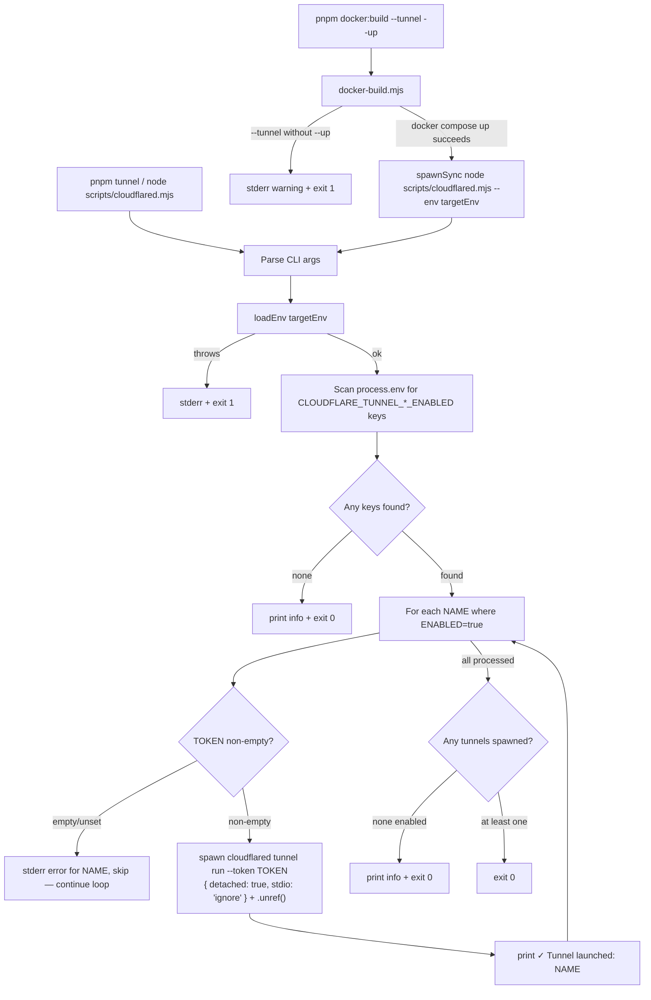

# Design Document — cloudflared-tunnel-launcher

## Overview

This feature adds `scripts/cloudflared.mjs`, a flat ESM script that discovers and launches all enabled Cloudflare tunnels declared in the active env file. It follows the same conventions as `scripts/docker-build.mjs`: `--env <name>` flag and `loadEnv(targetEnv)` for env loading. All configuration is sourced exclusively from `process.env` after `loadEnv` runs.

Tunnels are declared using a **named pattern** in each `.env.<name>` file:

```dotenv
CLOUDFLARE_TUNNEL_<NAME>_ENABLED=true|false
CLOUDFLARE_TUNNEL_<NAME>_TOKEN=$secret:...
```

Multiple tunnels can coexist in a single env file. After `loadEnv` runs, the script scans `process.env` for all `CLOUDFLARE_TUNNEL_<NAME>_ENABLED` keys, then spawns each enabled tunnel as a **detached background process** using `spawn()` with `{ detached: true, stdio: 'ignore' }` and `.unref()`. The parent process exits `0` immediately after spawning — it does not wait for tunnels to finish.

`TUNNEL_MODE` and `CLOUDFLARED_CONFIG_DIR` are dropped from the env files.

The script can be invoked standalone (`pnpm tunnel`) or chained after `docker compose up` via `docker-build.mjs --tunnel`.

---

## Architecture



`docker-build.mjs` spawns the launcher as a synchronous child process (so it can propagate a non-zero exit code if `loadEnv` fails). The launcher itself then spawns each `cloudflared` process detached and unreffed before exiting `0`.

---

## Components and Interfaces

### `scripts/cloudflared.mjs` (new)

Flat ESM script. No classes, no exports — same pattern as `docker-build.mjs`.

**Responsibilities:**

1. Parse `--env <name>` (default `"prod"`) and `--help` from `process.argv`
2. Call `loadEnv(targetEnv)`
3. Scan `process.env` for all keys matching `CLOUDFLARE_TUNNEL_<NAME>_ENABLED`
4. For each tunnel where `ENABLED=true`: validate token, spawn detached, print confirmation
5. Exit `0` after all enabled tunnels are spawned

**CLI interface:**

```
node scripts/cloudflared.mjs [--env <name>] [--help]

  --env <name>   Environment to load from .env.<name> (default: prod)
  --help         Print this help and exit
```

**Subprocess invocation (per enabled tunnel):**

```js
const child = spawn("cloudflared", ["tunnel", "run", "--token", token], {
  detached: true,
  stdio: "ignore",
});
child.unref();
```

### `scripts/docker-build.mjs` (modified)

Two additions only:

1. `--tunnel` flag parsed from `args`
2. After a successful `docker compose up`, if `--tunnel` is set:
   - Guard: `--tunnel` without `--up` → stderr warning + `process.exit(1)`
   - Spawn `node scripts/cloudflared.mjs --env <targetEnv>` via `spawnSync` with `stdio: "inherit"` and propagate exit code

### `scripts/cloudflared-stop.mjs` (new)

Flat ESM script. Mirror image of `cloudflared.mjs` — same `--env` flag, same `loadEnv` call, same tunnel discovery loop.

**Responsibilities:**

1. Parse `--env <name>` (default `"prod"`) and `--help` from `process.argv`
2. Call `loadEnv(targetEnv)`
3. Scan `process.env` for all keys matching `CLOUDFLARE_TUNNEL_<NAME>_ENABLED`
4. For each enabled tunnel: read the token, kill the matching `cloudflared` process, print result
5. Exit `0` after processing all tunnels (non-fatal if a process is not found)

**CLI interface:**

```
node scripts/cloudflared-stop.mjs [--env <name>] [--help]

  --env <name>   Environment to load from .env.<name> (default: prod)
  --help         Print this help and exit
```

**Process termination approach:**

Uses `spawnSync` to run a kill command that matches on the token string embedded in the process command line. This avoids storing PIDs and works reliably for detached processes:

```js
import { spawnSync } from "node:child_process";

// Cross-platform: try pkill (macOS/Linux), fall back to taskkill pattern on Windows
const result = spawnSync(
  "pkill",
  ["-f", `cloudflared tunnel run --token ${token}`],
  {
    stdio: "pipe",
  },
);
// pkill exit 0 = killed, exit 1 = no process found (non-fatal)
```

On Windows, substitute with a `taskkill /F /FI "COMMANDLINE eq ..."` equivalent or document as macOS/Linux only.

**Output per tunnel:**

- Process found and killed → `✓ Tunnel stopped: <NAME>` (stdout)
- No process found → `⚠ No running tunnel found for: <NAME>` (stdout, non-fatal)

### `package.json` (modified)

Add/update entries in `"scripts"`:

```json
"tunnel": "node scripts/cloudflared.mjs",
"tunnel:stop": "node scripts/cloudflared-stop.mjs",
"lint:env": "node scripts/check-env-parity.mjs"
```

The `"check:env-parity"` alias is removed — `"lint:env"` is the single canonical entry point.

### `scripts/check-env-parity.mjs` (modified)

Updated to exempt `CLOUDFLARE_TUNNEL_*` keys from parity checks. Since tunnel vars are intentionally asymmetric across environments (staging may have `APP` and `SUPABASE` tunnels; dev/prod may have none), requiring parity on these keys would produce false failures.

```js
const EXEMPT_PREFIXES = [/^CLOUDFLARE_TUNNEL_/];

function isExempt(key) {
  return EXEMPT_PREFIXES.some((re) => re.test(key));
}
```

Filter before iterating `keyMap`:

```js
// After building keyMap, skip exempt keys
let exemptCount = 0;
for (const key of [...keyMap.keys()]) {
  if (isExempt(key)) {
    keyMap.delete(key);
    exemptCount++;
  }
}
if (exemptCount > 0) {
  console.log(
    `  (${exemptCount} keys with CLOUDFLARE_TUNNEL_* prefix skipped)`,
  );
}
```

All non-exempt keys continue to require full parity. The exemption is additive — no existing behavior changes when no `CLOUDFLARE_TUNNEL_*` keys are present.

### `scripts/lint-envs.mjs` (deleted)

This file is superseded by `scripts/check-env-parity.mjs` and SHALL be deleted.

### Env files (modified)

Replace the existing `CLOUDFLARE_TUNNEL_TOKEN` / `CLOUDFLARED_CONFIG_DIR` block in each `.env.*` file with named tunnel pairs.

**Staging** (tunnels enabled):

```dotenv
# ─── Cloudflare tunnels ───────────────────────────────────────────
CLOUDFLARE_TUNNEL_APP_ENABLED=true
CLOUDFLARE_TUNNEL_APP_TOKEN=$secret:STAGING_CLOUDFLARE_TUNNEL_APP_TOKEN

CLOUDFLARE_TUNNEL_SUPABASE_ENABLED=true
CLOUDFLARE_TUNNEL_SUPABASE_TOKEN=$secret:STAGING_CLOUDFLARE_TUNNEL_SUPABASE_TOKEN
```

**Dev / prod** (tunnels disabled):

```dotenv
# ─── Cloudflare tunnels ───────────────────────────────────────────
CLOUDFLARE_TUNNEL_APP_ENABLED=false
CLOUDFLARE_TUNNEL_APP_TOKEN=
```

`TUNNEL_MODE` and `CLOUDFLARED_CONFIG_DIR` are removed from all env files.

---

## Data Models

No persistent data. All state is ephemeral `process.env` after `loadEnv` runs.

**Resolved env shape consumed by the launcher (per tunnel):**

```ts
interface TunnelEntry {
  name: string; // e.g. "APP", "SUPABASE"
  enabled: "true" | "false" | string; // validated at runtime
  token: string; // must be non-empty when enabled=true
}
```

**Scan result:**

```ts
// Keys discovered by scanning process.env:
// /^CLOUDFLARE_TUNNEL_(.+)_ENABLED$/  →  name = match[1]
type TunnelMap = Map<string, TunnelEntry>;
```

**`spawn` child handle used for unref:**

```ts
// child = spawn(..., { detached: true, stdio: 'ignore' })
// child.unref()  — parent does not wait
```

---

## Correctness Properties

_A property is a characteristic or behavior that should hold true across all valid executions of a system — essentially, a formal statement about what the system should do. Properties serve as the bridge between human-readable specifications and machine-verifiable correctness guarantees._

### Property 1: Token passthrough is exact

_For any_ set of named tunnels where each token is a non-empty string (including strings with special characters, spaces, or unusual length), the launcher SHALL pass each token as the exact `--token` argument to the corresponding `cloudflared` spawn call — no truncation, escaping, or transformation.

**Validates: Requirements 2.2, 6.3**

---

### Property 2: Per-tunnel token error is non-fatal

_For any_ collection of named tunnels where at least one has a non-empty token and at least one has an empty token, the launcher SHALL spawn processes for all tunnels with valid tokens and SHALL NOT exit early — tunnels with missing tokens are skipped with a stderr message, and the remaining tunnels are still launched.

**Validates: Requirements 2.4, 6.5**

---

### Property 3: loadEnv error message propagation

_For any_ error thrown by `loadEnv` (with any message string), the launcher SHALL include that error message in its stderr output and exit with code `1`.

**Validates: Requirements 1.4**

---

### Property 4: Spawn count matches enabled tunnels

_For any_ set of named tunnel env vars, the number of `spawn` calls made by the launcher SHALL equal exactly the number of tunnels where `ENABLED=true` AND `TOKEN` is non-empty.

**Validates: Requirements 2.1, 2.2, 2.3, 6.2**

---

### Property 5: unref is called on every spawned process

_For any_ set of enabled tunnels with valid tokens, the launcher SHALL call `.unref()` on every child process it spawns — no spawned process is left referenced.

**Validates: Requirements 3.2, 6.4**

---

### Property 6: docker-build propagates launcher exit code exactly

_For any_ non-zero exit code returned by the launcher subprocess when invoked from `docker-build.mjs --tunnel --up`, the docker-build script SHALL exit with that exact same code.

**Validates: Requirements 4.4**

---

## Error Handling

| Condition                                                        | Output                                                                 | Exit code            |
| ---------------------------------------------------------------- | ---------------------------------------------------------------------- | -------------------- |
| `loadEnv` throws (launcher or stopper)                           | `ERROR: Failed to load .env.<name>: <message>` → stderr                | `1`                  |
| `CLOUDFLARE_TUNNEL_<NAME>_ENABLED=true` but token is empty/unset | `ERROR: CLOUDFLARE_TUNNEL_<NAME>_TOKEN is not set — skipping` → stderr | continue (non-fatal) |
| No tunnels enabled across all discovered keys                    | informational → stdout                                                 | `0`                  |
| All enabled tunnels spawned successfully                         | `✓ Tunnel launched: <NAME>` per tunnel → stdout                        | `0`                  |
| `--tunnel` without `--up` in docker-build                        | warning → stderr                                                       | `1`                  |
| Tunnel process killed successfully (stopper)                     | `✓ Tunnel stopped: <NAME>` → stdout                                    | continue             |
| No running process found for tunnel (stopper)                    | `⚠ No running tunnel found for: <NAME>` → stdout                       | continue (non-fatal) |
| All stopper processing complete                                  | —                                                                      | `0`                  |

All fatal errors follow the `ERROR: <description>` prefix convention already used in `docker-build.mjs`. Per-tunnel token errors are non-fatal and use the same prefix for consistency.

---

## Testing Strategy

### Property-based testing

The project already has `fast-check` as a dev dependency and `vitest.config.scripts.js` targeting `scripts/__tests__/**/*.test.{js,ts,mjs}`. Property tests for this feature live in `scripts/__tests__/cloudflared.test.mjs`.

Each property test runs a minimum of 100 iterations. Tests mock `spawn` and `loadEnv` — no live `cloudflared` binary or Cloudflare account required.

**Tag format:** `// Feature: cloudflared-tunnel-launcher, Property <N>: <text>`

| Property                                 | Test approach                                                                                                                                    |
| ---------------------------------------- | ------------------------------------------------------------------------------------------------------------------------------------------------ |
| P1 — Token passthrough                   | `fc.array(fc.record({ name: fc.string(), token: fc.string({ minLength: 1 }) }))` for tunnels; assert each `spawn` call receives the exact token  |
| P2 — Per-tunnel token error is non-fatal | Generate mix of tunnels with valid and empty tokens; assert spawn called only for valid ones, stderr contains error for invalid ones, exit 0     |
| P3 — loadEnv error propagation           | `fc.string({ minLength: 1 })` for error message; assert stderr contains message + exit 1                                                         |
| P4 — Spawn count matches enabled tunnels | `fc.array(fc.record({ enabled: fc.boolean(), token: fc.string() }))` for tunnel configs; assert spawn call count equals enabled-with-token count |
| P5 — unref called on every spawn         | Same generator as P4; assert `.unref()` called once per spawned child                                                                            |
| P6 — docker-build exit propagation       | `fc.integer({ min: 1, max: 255 })` for launcher status; assert docker-build exits same                                                           |

### Unit / example-based tests

Cover the deterministic paths that don't benefit from randomisation:

- `--help` prints usage and exits 0
- No `CLOUDFLARE_TUNNEL_*_ENABLED` keys found → informational message + exit 0
- All discovered tunnels have `ENABLED=false` → no spawns + exit 0
- Single tunnel `ENABLED=true` with valid token → one `spawn` call + `.unref()` + exit 0
- Single tunnel `ENABLED=true` with empty token → stderr error + exit 0 (non-fatal)
- Two tunnels: one valid, one missing token → one spawn + one stderr error + exit 0
- `--tunnel` without `--up` in docker-build → stderr warning + exit 1
- `--tunnel` + `--up` + no enabled tunnels → launcher exits 0, docker-build exits 0

**Stopper (`cloudflared-stop.mjs`):**

- Single enabled tunnel, `pkill` exits 0 → prints `✓ Tunnel stopped: <NAME>` + exits 0
- Single enabled tunnel, `pkill` exits 1 (no process) → prints warning + exits 0 (non-fatal)
- Two enabled tunnels: one found, one not → one success + one warning + exits 0
- `loadEnv` throws → stderr error + exits 1

**Env linter (`check-env-parity.mjs`):**

- Env files with `CLOUDFLARE_TUNNEL_*` keys only in some files → passes + prints skip note
- Env files with a non-tunnel key missing from one file → still fails (exemption is scoped)
- No `CLOUDFLARE_TUNNEL_*` keys present → output identical to current behavior (no skip note)

### Integration / smoke tests (manual)

- `pnpm tunnel --env staging` with a real `.secrets` file spawns `cloudflared` processes in the background and exits immediately
- `pnpm tunnel:stop --env staging` kills the previously spawned processes and prints confirmation
- `pnpm docker:build --env staging --up --tunnel` chains correctly after container start
- `package.json` `"tunnel"` and `"tunnel:stop"` entries exist with correct values (verified by a smoke test reading `package.json`)
- `pnpm lint:env` passes on the repo's actual env files despite staging having `CLOUDFLARE_TUNNEL_*` keys that dev/prod do not
