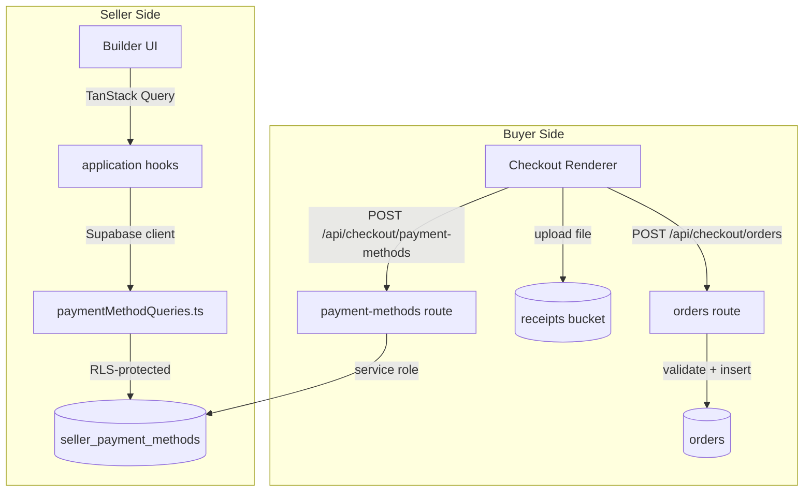

# Design Document — Customizable Payment Method

## Overview

This feature replaces the current two-table payment method system (`payment_method_types` +
`seller_payment_methods`) with a single, fully seller-owned table. Each seller creates payment
methods from scratch: they give it a bilingual name, compose a **display section** (rich content
blocks shown to the buyer), and define a **form section** (dynamic input fields the buyer fills at
checkout). The old admin-managed type catalog is removed entirely.

The change touches three surfaces:

1. **Database** — one new migration drops the old tables and creates the new `seller_payment_methods`
   table with JSONB columns for `display_blocks` and `form_fields`.
2. **Builder UI** (`apps/payments`) — the seller-facing editor is rebuilt around the new schema.
3. **Checkout Renderer** (`apps/payments`) — the buyer-facing checkout card renders display blocks
   and dynamic form fields instead of the old fixed fields.

---

## Architecture

The feature follows the existing Clean Architecture layering inside `apps/payments`:

```
features/payment-methods/
├── domain/          ← types, validation pure functions, constants
├── application/     ← TanStack Query hooks (usePaymentMethods, useSavePaymentMethod, …)
├── infrastructure/  ← Supabase queries (paymentMethodQueries.ts)
└── presentation/    ← Builder pages and components

features/checkout/
├── domain/          ← updated types (SellerPaymentMethodWithType → new shape)
├── application/     ← useSellerPaymentMethods hook (updated)
├── infrastructure/  ← checkoutQueries.ts (updated), file upload helper
└── presentation/    ← DisplayBlockRenderer, DynamicFormField, updated SellerCheckoutContent
```

The API route `apps/payments/src/app/api/checkout/payment-methods/route.ts` is updated to query
the new table shape. A new API route `apps/payments/src/app/api/checkout/orders/route.ts` handles
order creation with buyer submission validation.



---

## Components and Interfaces

### Builder UI Components

| Component                   | Responsibility                                                |
| --------------------------- | ------------------------------------------------------------- |
| `PaymentMethodsPageContent` | Lists all seller payment methods; entry point for create/edit |
| `PaymentMethodEditor`       | Top-level editor: name fields + two section editors           |
| `DisplaySectionEditor`      | Ordered list of display block editors; add/remove/reorder     |
| `DisplayBlockEditor`        | Renders the correct sub-editor for a block's type             |
| `FormSectionEditor`         | Ordered list of form field editors; add/remove/reorder        |
| `FormFieldEditor`           | Renders inputs for label, type, required, placeholder         |

### Checkout Renderer Components

| Component               | Responsibility                                                        |
| ----------------------- | --------------------------------------------------------------------- |
| `SellerCheckoutContent` | Updated: replaces old fixed fields with new renderer components       |
| `DisplayBlockRenderer`  | Renders a single display block (text / image / video / link)          |
| `DynamicFormField`      | Renders a single form field (text / email / number / file / textarea) |

### API Routes

| Route                           | Method | Purpose                                                      |
| ------------------------------- | ------ | ------------------------------------------------------------ |
| `/api/checkout/payment-methods` | POST   | Returns active payment methods for a seller (updated shape)  |
| `/api/checkout/orders`          | POST   | Validates buyer submission, creates order, stores buyer_info |

---

## Data Models

### New `seller_payment_methods` Table

```sql
create table public.seller_payment_methods (
  id          uuid        primary key default gen_random_uuid(),
  seller_id   uuid        not null references auth.users(id) on delete cascade,
  name_en     text        not null,
  name_es     text,
  display_blocks jsonb    not null default '[]'::jsonb,
  form_fields    jsonb    not null default '[]'::jsonb,
  is_active   boolean     not null default true,
  sort_order  integer     not null default 0,
  created_at  timestamptz not null default now(),
  updated_at  timestamptz not null default now()
);
```

Bilingual name follows the `_en`/`_es` suffix pattern used throughout the codebase (resolved via
`i18nField(method, 'name', locale)`). If only one language is provided, `i18nField` falls back to
whichever is available.

### DisplayBlock TypeScript Type

```typescript
type DisplayBlockType = "text" | "image" | "video" | "link" | "url";

interface DisplayBlockBase {
  id: string; // stable nanoid assigned at creation
  type: DisplayBlockType;
}

interface TextBlock extends DisplayBlockBase {
  type: "text";
  content_en: string;
  content_es?: string;
}

interface ImageBlock extends DisplayBlockBase {
  type: "image";
  url: string;
  alt_en?: string;
  alt_es?: string;
}

interface VideoBlock extends DisplayBlockBase {
  type: "video";
  url: string; // stored as embed URL (auto-converted from watch/short URLs)
}

interface LinkBlock extends DisplayBlockBase {
  type: "link";
  url: string;
  label_en: string;
  label_es?: string;
}

interface UrlBlock extends DisplayBlockBase {
  type: "url";
  url: string;
  label_en?: string;
  label_es?: string;
}

type DisplayBlock = TextBlock | ImageBlock | VideoBlock | LinkBlock | UrlBlock;
```

### FormField TypeScript Type

```typescript
type FormFieldType = "text" | "email" | "number" | "file" | "textarea";

interface FormField {
  id: string; // stable nanoid assigned at creation
  type: FormFieldType;
  label_en: string;
  label_es?: string;
  placeholder_en?: string;
  placeholder_es?: string;
  required: boolean; // defaults to true
}
```

### Updated `SellerPaymentMethodWithType` (checkout domain)

The old type referenced `payment_method_types` join columns. The new type is flat:

```typescript
interface SellerPaymentMethodWithType {
  id: string;
  name_en: string;
  name_es: string | null;
  display_blocks: DisplayBlock[];
  form_fields: FormField[];
  is_active: boolean;
}
```

### Buyer Submission (stored in `orders.buyer_info`)

```typescript
// Key = FormField.id, value = string (file fields store the Supabase Storage URL)
type BuyerSubmission = Record<string, string>;
```

Using `field.id` as the key (rather than label) ensures stability if the seller later edits a
label. The order review UI resolves labels by matching the stored field id against the payment
method's `form_fields` array.

---

## YouTube URL Conversion

The `video` block type accepts YouTube watch URLs and short links and converts them to embed URLs
before storage. This is a pure utility function:

```typescript
// packages/shared/src/utils/youtubeEmbed.ts  (or apps/payments/src/shared/…)
export function toYouTubeEmbedUrl(input: string): string | null {
  // https://www.youtube.com/watch?v=ID
  const watchMatch = input.match(/youtube\.com\/watch\?v=([\w-]+)/);
  if (watchMatch) return `https://www.youtube.com/embed/${watchMatch[1]}`;

  // https://youtu.be/ID
  const shortMatch = input.match(/youtu\.be\/([\w-]+)/);
  if (shortMatch) return `https://www.youtube.com/embed/${shortMatch[1]}`;

  // Already an embed URL or unrecognised — return as-is
  return input.startsWith("https://www.youtube.com/embed/") ? input : null;
}
```

The Builder calls this on save; the Checkout Renderer receives the already-converted embed URL.

---

## Correctness Properties

_A property is a characteristic or behavior that should hold true across all valid executions of a
system — essentially, a formal statement about what the system should do. Properties serve as the
bridge between human-readable specifications and machine-verifiable correctness guarantees._

### Property 1: JSONB round-trip

_For any_ valid array of `DisplayBlock` objects or `FormField` objects, serializing the array to a
JSON string and then deserializing it back should produce a structurally equivalent array (same
ids, types, and field values in the same order).

**Validates: Requirements 2.6, 3.5, 10.6**

---

### Property 2: Empty/whitespace input rejection

_For any_ string composed entirely of whitespace characters (including the empty string), the
validation functions for payment method name, display block URL, and form field label should all
return a validation error and should not produce a persisted record.

**Validates: Requirements 1.3, 2.10, 3.2, 3.9**

---

### Property 3: New payment method has empty sections

_For any_ valid non-empty payment method name, creating a new payment method should produce a
record where `display_blocks` is an empty array and `form_fields` is an empty array.

**Validates: Requirements 1.2**

---

### Property 4: Block and field removal by id

_For any_ non-empty array of `DisplayBlock` or `FormField` objects and any id that exists in that
array, removing the element with that id should produce an array that does not contain any element
with that id, and all other elements should remain unchanged.

**Validates: Requirements 2.7, 3.6**

---

### Property 5: Reorder preserves all elements

_For any_ array of `DisplayBlock` or `FormField` objects and any permutation of their ids, applying
the reorder operation should produce an array that contains exactly the same elements (same ids,
same count) in the new order, with no elements added or lost.

**Validates: Requirements 2.8, 2.9, 3.7, 3.8, 4.7**

---

### Property 6: Inactive payment methods excluded from checkout

_For any_ set of a seller's payment methods where some have `is_active = false`, the checkout
payment methods query should return only the methods where `is_active = true`, regardless of how
many inactive methods exist.

**Validates: Requirements 4.4**

---

### Property 7: Renderer preserves block and field order

_For any_ array of `DisplayBlock` or `FormField` objects, the renderer component should output
elements in the same order as the input array — the nth rendered element should correspond to the
nth element of the input array.

**Validates: Requirements 6.1, 7.1**

---

### Property 8: Required field validation

_For any_ array of `FormField` objects and any `BuyerSubmission` map, the validation function
should return a non-empty list of missing field labels if and only if at least one field with
`required: true` has no corresponding non-empty value in the submission map.

**Validates: Requirements 7.9, 7.10**

---

### Property 9: Buyer submission round-trip

_For any_ valid `BuyerSubmission` (all required fields present), creating an order and then reading
back `orders.buyer_info` should produce a map that contains every key-value pair from the original
submission.

**Validates: Requirements 7.11**

---

### Property 10: File size threshold

_For any_ file size in bytes, the client-side size validator should accept the file if and only if
its size is less than or equal to 10 × 1024 × 1024 bytes (10 MB).

**Validates: Requirements 8.4, 8.5**

---

### Property 11: Schema type validation

_For any_ string that is not a member of `{'text','image','video','link','url'}` used as a
`DisplayBlock` type, or any string not in `{'text','email','number','file','textarea'}` used as a
`FormField` type, the schema validator should return a validation error.

**Validates: Requirements 10.1, 10.2**

---

### Property 12: Stable id assignment

_For any_ valid `DisplayBlock` or `FormField` input that does not already carry an id, the creation
helper should assign a non-empty string id, and that id should be preserved through subsequent
serialization and deserialization.

**Validates: Requirements 10.5**

---

### Property 13: YouTube URL conversion round-trip

_For any_ valid YouTube watch URL (`youtube.com/watch?v=ID`) or short URL (`youtu.be/ID`), the
`toYouTubeEmbedUrl` function should return a URL of the form
`https://www.youtube.com/embed/{ID}` where `{ID}` is the same video id as in the input.

**Validates: Requirements 2.4 (video block URL acceptance)**

---

## Error Handling

| Scenario                                              | Handling                                                                   |
| ----------------------------------------------------- | -------------------------------------------------------------------------- |
| Payment method name is empty/whitespace               | Client-side validation error; no API call                                  |
| Display block URL is empty/whitespace                 | Client-side validation error; block not saved                              |
| Form field label is empty/whitespace                  | Client-side validation error; field not saved                              |
| YouTube URL cannot be parsed                          | Builder shows inline error; block not saved                                |
| Image/video fails to load in renderer                 | Renderer shows a fallback placeholder `<div>`; checkout flow continues     |
| Required buyer field missing on submit                | API returns 422 with list of missing field labels; order not created       |
| File exceeds 10 MB                                    | Client-side check before upload; error message shown; upload not attempted |
| Supabase Storage upload fails                         | Error message shown in checkout; order creation blocked                    |
| Supabase DB error on order insert                     | API returns 500; stock reservations are released (existing pattern)        |
| Inactive payment method requested                     | Checkout API filters it out; buyer sees no option                          |
| RLS violation (seller reads another seller's methods) | Supabase returns empty result; no data leaked                              |

---

## Testing Strategy

### Unit Tests (Vitest)

Focus on pure domain logic and component rendering:

- `validatePaymentMethodName(name)` — whitespace rejection (Property 2)
- `validateDisplayBlock(block)` — URL and type validation (Properties 2, 11)
- `validateFormField(field)` — label and type validation (Properties 2, 11)
- `toYouTubeEmbedUrl(url)` — conversion correctness (Property 13)
- `assignBlockId(block)` / `assignFieldId(field)` — id assignment (Property 12)
- `removeById(array, id)` — removal logic (Property 4)
- `reorderById(array, newOrder)` — reorder logic (Property 5)
- `validateBuyerSubmission(fields, submission)` — required field check (Property 8)
- `validateFileSize(bytes)` — threshold check (Property 10)
- `DisplayBlockRenderer` — renders correct element per block type (Requirements 6.2–6.5)
- `DynamicFormField` — renders correct input per field type (Requirements 7.2–7.6)
- `DisplaySectionEditor` / `FormSectionEditor` — add/remove/reorder interactions

### Property-Based Tests (fast-check, Vitest)

Each property test runs a minimum of 100 iterations. Tag format:
`// Feature: customizable-payment-method, Property N: <property text>`

| Property                       | Generator strategy                                              |
| ------------------------------ | --------------------------------------------------------------- |
| P1 JSONB round-trip            | Generate random arrays of valid DisplayBlock/FormField objects  |
| P2 Whitespace rejection        | Generate strings from `fc.string()` filtered to whitespace-only |
| P3 Empty sections on create    | Generate arbitrary non-empty name strings                       |
| P4 Removal by id               | Generate non-empty arrays + pick a random id from the array     |
| P5 Reorder preserves elements  | Generate arrays + random permutations of their ids              |
| P6 Inactive exclusion          | Generate mixed active/inactive method arrays                    |
| P7 Renderer order              | Generate ordered arrays, render, assert output order            |
| P8 Required field validation   | Generate form_fields arrays + partial/complete submissions      |
| P9 Buyer submission round-trip | Generate complete valid submissions, mock DB insert/read        |
| P10 File size threshold        | Generate integers around the 10 MB boundary                     |
| P11 Schema type validation     | Generate arbitrary strings, assert rejection of non-members     |
| P12 Stable id assignment       | Generate valid block/field inputs without ids                   |
| P13 YouTube URL conversion     | Generate valid YouTube watch/short URLs with random video ids   |

### Integration Tests

- File upload to `receipts` bucket: 1–2 examples verifying upload succeeds and URL is stored
- Full checkout flow: select method → fill form → upload file → create order → verify `buyer_info`
- RLS: verify a seller cannot read another seller's payment methods

### Migration Smoke Test

- Verify `seller_payment_methods` table exists with correct columns
- Verify `payment_method_types` table is dropped
- Verify RLS policies are in place
