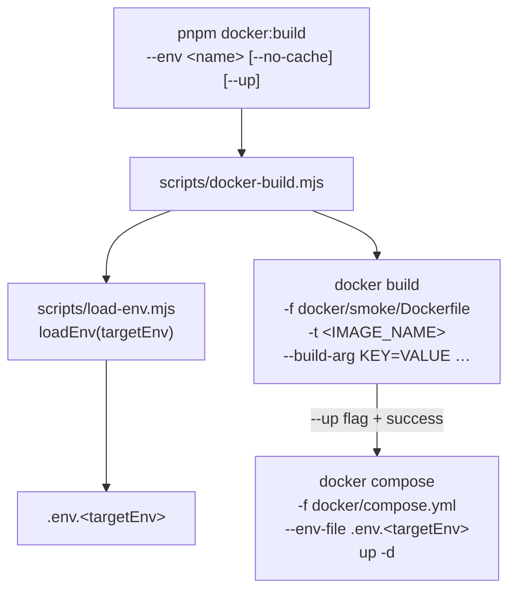

# Design Document — docker-builder

## Overview

`scripts/docker-build.mjs` is a thin Node.js ESM script that wraps `docker build` (and optionally `docker compose up -d`) for any named environment. It is the single authoritative way to build the production Docker image locally, in CI, and on deploy servers.

All configuration flows from one source: `loadEnv(targetEnv)` from `scripts/load-env.mjs`. After that call, every value the script needs — image name, container name, build args — is read from `process.env`. Nothing is hardcoded.

Two supporting artifacts are also created as part of this feature:

- `docker/compose.yml` — a minimal Compose file that references the image and container names via env-var substitution and derives the host port from `APP_PUBLIC_ORIGIN`.
- `docker/smoke/Dockerfile` — patched to add the three missing `ARG`/`ENV` declarations (`NEXT_PUBLIC_AUTH_HOST_URL`, `APP_PUBLIC_ORIGIN`, `NEXT_PUBLIC_ENABLE_TEST_IDS`).

---

## Architecture



The script is intentionally flat — no classes, no abstraction layers. It mirrors the pattern already established by `scripts/build.mjs`: parse args → load env → `spawnSync` with `stdio: "inherit"`.

---

## Components and Interfaces

### `scripts/docker-build.mjs`

Entry point. Responsibilities:

1. Parse `--env`, `--no-cache`, `--up`, `--help` from `process.argv`.
2. Call `loadEnv(targetEnv)` — this populates `process.env` from `.env.<targetEnv>`.
3. Read `SITE_PROD_IMAGE_NAME` and `SITE_PROD_CONTAINER_NAME` from `process.env`.
4. Collect build args by reading the known `NEXT_PUBLIC_*` keys plus `APP_PUBLIC_ORIGIN` from `process.env`.
5. Invoke `docker build` via `spawnSync` with `stdio: "inherit"`.
6. If `--up` and build succeeded, invoke `docker compose … up -d` via `spawnSync` with `stdio: "inherit"`.
7. Exit with the appropriate code.

**CLI surface:**

```
node scripts/docker-build.mjs [--env <name>] [--no-cache] [--up] [--help]

  --env <name>   Environment to load (default: prod)
  --no-cache     Pass --no-cache to docker build
  --up           Run docker compose up -d after a successful build
  --help         Print this help and exit
```

**Build-arg keys** (read from `process.env` after `loadEnv` runs):

```
NEXT_PUBLIC_SUPABASE_URL
NEXT_PUBLIC_SUPABASE_ANON_KEY
NEXT_PUBLIC_AUTH_URL
NEXT_PUBLIC_AUTH_HOST_URL
NEXT_PUBLIC_STORE_URL
NEXT_PUBLIC_ADMIN_URL
NEXT_PUBLIC_PLAYGROUND_URL
NEXT_PUBLIC_LANDING_URL
NEXT_PUBLIC_PAYMENTS_URL
NEXT_PUBLIC_STUDIO_URL
NEXT_PUBLIC_BUILD_HASH
NEXT_PUBLIC_ENABLE_TEST_IDS
APP_PUBLIC_ORIGIN
```

### `docker/compose.yml`

A minimal Compose file. It uses variable substitution so the same file works for every environment — the caller passes `--env-file .env.<targetEnv>` to resolve the variables at runtime.

Host port derivation: parse the port from `APP_PUBLIC_ORIGIN` (e.g. `http://localhost:8088` → `8088`). If the origin has no explicit port (e.g. `https://store.ffxivbe.org`), default to `8088`.

```yaml
services:
  app:
    image: ${SITE_PROD_IMAGE_NAME}
    container_name: ${SITE_PROD_CONTAINER_NAME}
    ports:
      - "${HOST_PORT:-8088}:80"
    restart: unless-stopped
```

Because `APP_PUBLIC_ORIGIN` requires parsing to extract the port, the script computes `HOST_PORT` before invoking compose and passes it as an environment variable (or via `--env-file`). The simplest approach: the script sets `process.env.HOST_PORT` before calling `spawnSync` for the compose step.

### `docker/smoke/Dockerfile` (patch)

Add the three missing `ARG`/`ENV` pairs in the build-args block:

```dockerfile
ARG NEXT_PUBLIC_AUTH_HOST_URL
ARG APP_PUBLIC_ORIGIN
ARG NEXT_PUBLIC_ENABLE_TEST_IDS

ENV NEXT_PUBLIC_AUTH_HOST_URL=$NEXT_PUBLIC_AUTH_HOST_URL
ENV APP_PUBLIC_ORIGIN=$APP_PUBLIC_ORIGIN
ENV NEXT_PUBLIC_ENABLE_TEST_IDS=$NEXT_PUBLIC_ENABLE_TEST_IDS
```

### `package.json` patch

Add to `scripts`:

```json
"docker:build": "node scripts/docker-build.mjs"
```

---

## Data Models

### Parsed CLI options

```ts
interface CliOptions {
  targetEnv: string; // --env value, default "prod"
  noCache: boolean; // --no-cache present
  up: boolean; // --up present
  help: boolean; // --help present
}
```

### Resolved build configuration (runtime, not a class)

```ts
interface BuildConfig {
  imageName: string; // process.env.SITE_PROD_IMAGE_NAME
  containerName: string; // process.env.SITE_PROD_CONTAINER_NAME
  hostPort: number; // parsed from APP_PUBLIC_ORIGIN, default 8088
  buildArgs: Record<string, string>; // keyed by the 13 build-arg names
}
```

### Port parsing logic

```
function parseHostPort(appPublicOrigin: string): number {
  try {
    const url = new URL(appPublicOrigin);
    const port = parseInt(url.port, 10);
    return isNaN(port) ? 8088 : port;
  } catch {
    return 8088;
  }
}
```

---

## Correctness Properties

_A property is a characteristic or behavior that should hold true across all valid executions of a system — essentially, a formal statement about what the system should do. Properties serve as the bridge between human-readable specifications and machine-verifiable correctness guarantees._

### Property 1: Image name is always sourced from env

_For any_ string value of `SITE_PROD_IMAGE_NAME` set in `process.env`, the `-t` flag passed to `docker build` SHALL equal that value exactly.

**Validates: Requirements 1.5, 2.1**

---

### Property 2: All build args are sourced from env

_For any_ set of values assigned to the 13 build-arg keys (`NEXT_PUBLIC_SUPABASE_URL`, `NEXT_PUBLIC_SUPABASE_ANON_KEY`, `NEXT_PUBLIC_AUTH_URL`, `NEXT_PUBLIC_AUTH_HOST_URL`, `NEXT_PUBLIC_STORE_URL`, `NEXT_PUBLIC_ADMIN_URL`, `NEXT_PUBLIC_PLAYGROUND_URL`, `NEXT_PUBLIC_LANDING_URL`, `NEXT_PUBLIC_PAYMENTS_URL`, `NEXT_PUBLIC_STUDIO_URL`, `NEXT_PUBLIC_BUILD_HASH`, `NEXT_PUBLIC_ENABLE_TEST_IDS`, `APP_PUBLIC_ORIGIN`) in `process.env`, every key-value pair SHALL appear as a `--build-arg KEY=VALUE` in the `docker build` invocation.

**Validates: Requirements 2.2**

---

### Property 3: Compose is never called after a failed build

_For any_ invocation of the script with `--up`, if `docker build` exits with a non-zero status code, `docker compose up -d` SHALL NOT be invoked.

**Validates: Requirements 4.5**

---

### Property 4: Success message always contains the image name

_For any_ string value of `SITE_PROD_IMAGE_NAME`, when `docker build` exits with code `0`, the success message printed to stdout SHALL contain that image name.

**Validates: Requirements 6.3**

---

## Error Handling

| Failure point                                  | Behavior                                                                               |
| ---------------------------------------------- | -------------------------------------------------------------------------------------- |
| `loadEnv` throws (missing env file)            | Print error to stderr, `process.exit(1)`                                               |
| `loadEnv` throws (unresolved `$secret:`)       | Print error to stderr, `process.exit(1)`                                               |
| `SITE_PROD_IMAGE_NAME` not set after `loadEnv` | Print descriptive error to stderr, `process.exit(1)`                                   |
| `docker build` non-zero exit                   | Print `"ERROR: docker build failed (exit <code>)"` to stderr, exit with same code      |
| `docker compose up -d` non-zero exit           | Print `"ERROR: docker compose up failed (exit <code>)"` to stderr, exit with same code |

All Docker subprocess output is streamed in real time via `stdio: "inherit"` — the script never buffers or suppresses it.

---

## Testing Strategy

This feature is a Node.js CLI script with no UI and no external state. The testing approach mirrors `scripts/build.mjs`.

**Unit tests** (`scripts/__tests__/docker-build.test.mjs` or similar):

- Mock `spawnSync` to capture the arguments it is called with.
- Mock `loadEnv` to control `process.env` state.
- Test each CLI flag combination with concrete examples.
- Test error paths (non-zero exit codes, thrown `loadEnv`).

**Property-based tests** (using `fast-check`, already in `devDependencies`):

- Property 1: generate random image name strings → assert `-t` arg matches.
- Property 2: generate random values for all 13 build-arg keys → assert all appear as `--build-arg` flags.
- Property 3: generate random non-zero exit codes from `docker build` → assert compose is never called.
- Property 4: generate random image name strings → assert success message contains the name.

Each property test runs a minimum of 100 iterations.

Tag format for property tests:

```
// Feature: docker-builder, Property 1: image name is always sourced from env
// Feature: docker-builder, Property 2: all build args are sourced from env
// Feature: docker-builder, Property 3: compose is never called after a failed build
// Feature: docker-builder, Property 4: success message always contains the image name
```

**Smoke checks** (manual / CI):

- `package.json` contains `docker:build` script entry.
- `docker/compose.yml` exists and is valid YAML.
- `docker/smoke/Dockerfile` contains all 13 `ARG` declarations.
