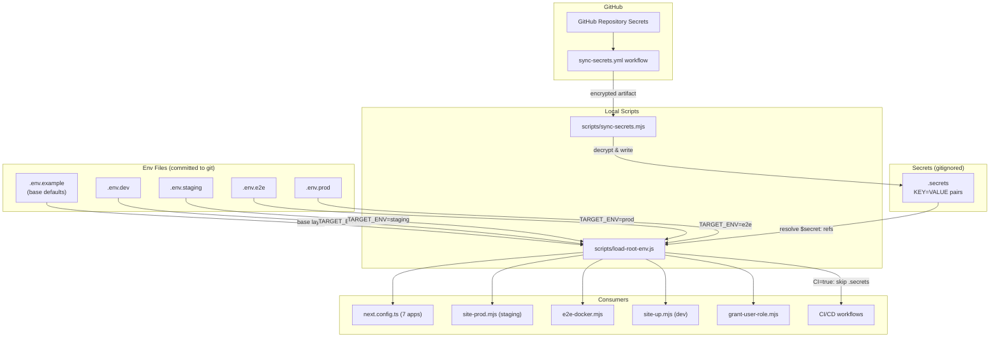
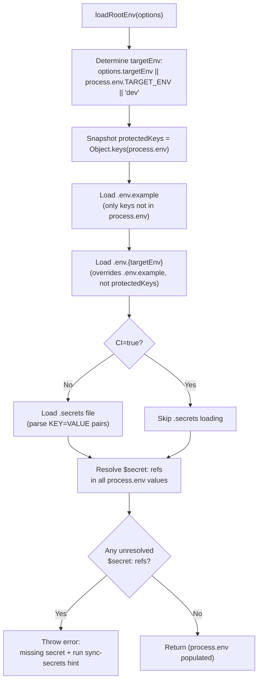
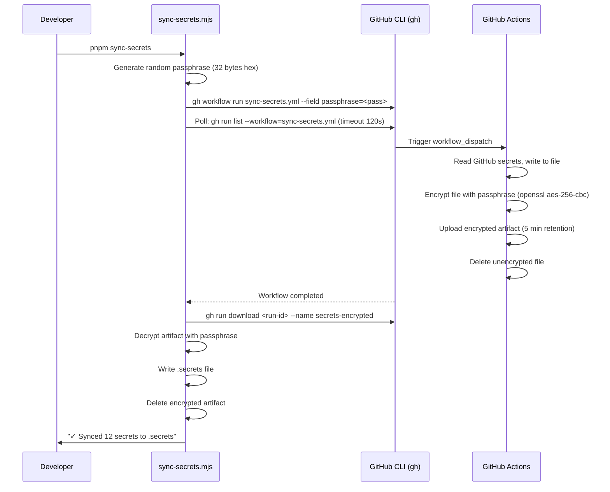

# Design Document: Environment & Secret Management

## Overview

This design restructures the candystore monorepo's environment variable and secret management from a single shared `.env` file into per-environment self-contained env files with a `$secret:` reference syntax for sensitive values. The system introduces:

1. **Per-environment env files** (`.env.dev`, `.env.staging`, `.env.e2e`, `.env.prod`) — each is self-contained with all non-secret configuration for its target environment.
2. **Secret reference syntax** (`$secret:KEY_NAME`) — env files reference secrets by name; actual values live in a gitignored `.secrets` file.
3. **Updated `load-root-env.js`** — accepts `TARGET_ENV`, loads the correct env file, resolves secret references from `.secrets`, and maintains backward compatibility.
4. **GitHub Actions sync workflow** (`sync-secrets.yml`) — packages repository secrets into an encrypted artifact for secure local download.
5. **Local sync script** (`scripts/sync-secrets.mjs`) — triggers the workflow, downloads and decrypts the artifact, writes `.secrets`.
6. **Script integration** — `package.json` scripts set `TARGET_ENV` so downstream consumers (`next.config.ts`, Docker builds, Playwright) receive the correct environment automatically.

### Design Rationale

The current system requires developers to manually edit `.env` when switching environments, which causes cross-environment leakage and misconfiguration. The new design eliminates this by making each environment file self-contained and committed to git (secrets excluded via `$secret:` references). This means `pnpm dev`, `pnpm staging`, `pnpm test:e2e`, and production builds each load the right configuration without manual intervention.

## Architecture



### Loading Precedence

The env loader applies values in this order (highest wins):

1. **`process.env`** — CLI/CI injected variables (never overwritten)
2. **Secret resolution** — `$secret:KEY_NAME` references resolved from `.secrets`
3. **Target env file** — `.env.{TARGET_ENV}` (environment-specific overrides)
4. **Base defaults** — `.env.example` (committed defaults)

### CI Behavior

When `CI=true` is set (GitHub Actions), the loader skips `.secrets` file loading entirely. Secret values are injected directly into `process.env` by the CI platform. Any unresolved `$secret:` references in this mode cause a clear error, ensuring CI never silently runs with missing secrets.

## Components and Interfaces

### 1. `scripts/load-root-env.js` (Updated Env Loader)

The existing CJS module is extended with `TARGET_ENV` support and secret resolution. It remains a CommonJS module because it's consumed via `require()` in `next.config.ts` files.

```javascript
/**
 * @param {object} [options]
 * @param {string} [options.targetEnv] - Override for TARGET_ENV (defaults to process.env.TARGET_ENV || 'dev')
 */
function loadRootEnv(options = {}) { ... }

/**
 * Check if a value contains a $secret: reference.
 * @param {string} value
 * @returns {boolean}
 */
function containsSecretRef(value) { ... }

/**
 * Resolve a single value's $secret: references against a secrets map.
 * @param {string} value - The raw value (may contain $secret:KEY_NAME)
 * @param {Record<string, string>} secrets - The loaded secrets map
 * @returns {string} - The resolved value
 * @throws {Error} - If a referenced secret key is not found
 */
function resolveSecretRef(value, secrets) { ... }

module.exports = { loadRootEnv, containsSecretRef, resolveSecretRef };
```

**Internal flow of `loadRootEnv()`:**



**Backward compatibility:** Existing callers that call `loadRootEnv()` with no arguments continue to work — they get `dev` environment by default, which matches the current behavior of loading `.env.example` + `.env`.

### 2. Secret Reference Parser

The parser handles the `$secret:KEY_NAME` pattern within env file values.

**Grammar:**

- Secret reference: `$secret:` followed by `[A-Z][A-Z0-9_]*`
- Escape: `$$secret:` is treated as the literal string `$secret:` (not a reference)
- A value may contain a mix of literal text and secret references (though in practice, values are typically either entirely a secret reference or entirely literal)

**Functions:**

| Function                           | Input                              | Output                   | Description                                                                         |
| ---------------------------------- | ---------------------------------- | ------------------------ | ----------------------------------------------------------------------------------- |
| `containsSecretRef(value)`         | `string`                           | `boolean`                | Returns `true` if value contains at least one unescaped `$secret:KEY_NAME`          |
| `resolveSecretRef(value, secrets)` | `string`, `Record<string, string>` | `string`                 | Replaces all `$secret:KEY_NAME` with values from secrets map; throws on missing key |
| `parseSecretsFile(filePath)`       | `string`                           | `Record<string, string>` | Parses `.secrets` file into key-value map                                           |

### 3. `scripts/sync-secrets.mjs` (Local Sync Script)

An ESM script that orchestrates secret syncing from GitHub to the local `.secrets` file.

**Flow:**



**Prerequisites:**

- `gh` CLI installed and authenticated (`gh auth status`)
- Repository access with workflow dispatch permissions

**CLI interface:**

```
pnpm sync-secrets          # Sync all secrets from GitHub
```

### 4. `.github/workflows/sync-secrets.yml` (GitHub Actions Workflow)

A `workflow_dispatch` workflow that reads repository secrets and produces an encrypted artifact.

**Inputs:**

- `passphrase` (required): One-time encryption passphrase provided by the sync script

**Steps:**

1. Write all required secrets to a temporary file in `KEY=VALUE` format
2. Encrypt the file using `openssl aes-256-cbc -pbkdf2 -pass pass:<passphrase>`
3. Upload encrypted file as artifact with 5-minute retention
4. Delete unencrypted file (in a `post` / `always` step)

**Secret mapping** — the workflow maps GitHub secret names to the env-prefixed keys used in `.secrets`:

| GitHub Secret                              | `.secrets` Key                             |
| ------------------------------------------ | ------------------------------------------ |
| `DEV_SUPABASE_ANON_KEY`                    | `DEV_SUPABASE_ANON_KEY`                    |
| `DEV_SUPABASE_SERVICE_ROLE_KEY`            | `DEV_SUPABASE_SERVICE_ROLE_KEY`            |
| `STAGING_SUPABASE_ANON_KEY`                | `STAGING_SUPABASE_ANON_KEY`                |
| `STAGING_SUPABASE_SERVICE_ROLE_KEY`        | `STAGING_SUPABASE_SERVICE_ROLE_KEY`        |
| `E2E_SUPABASE_ANON_KEY`                    | `E2E_SUPABASE_ANON_KEY`                    |
| `E2E_SUPABASE_SERVICE_ROLE_KEY`            | `E2E_SUPABASE_SERVICE_ROLE_KEY`            |
| `PROD_SUPABASE_ANON_KEY`                   | `PROD_SUPABASE_ANON_KEY`                   |
| `PROD_SUPABASE_SERVICE_ROLE_KEY`           | `PROD_SUPABASE_SERVICE_ROLE_KEY`           |
| `SUPABASE_AUTH_EXTERNAL_GOOGLE_CLIENT_ID`  | `SUPABASE_AUTH_EXTERNAL_GOOGLE_CLIENT_ID`  |
| `SUPABASE_AUTH_EXTERNAL_GOOGLE_SECRET`     | `SUPABASE_AUTH_EXTERNAL_GOOGLE_SECRET`     |
| `SUPABASE_AUTH_EXTERNAL_DISCORD_CLIENT_ID` | `SUPABASE_AUTH_EXTERNAL_DISCORD_CLIENT_ID` |
| `SUPABASE_AUTH_EXTERNAL_DISCORD_SECRET`    | `SUPABASE_AUTH_EXTERNAL_DISCORD_SECRET`    |

### 5. Env File Structure

Each env file is self-contained. The `$secret:` prefix maps to environment-prefixed keys in `.secrets`.

**`.env.dev`** — Local development against local Supabase:

```dotenv
# Dev environment — local Supabase at 127.0.0.1:54321
# Used by: pnpm dev, pnpm dev:up

# Supabase (local instance from `supabase start`)
NEXT_PUBLIC_SUPABASE_URL=http://127.0.0.1:54321
NEXT_PUBLIC_SUPABASE_ANON_KEY=$secret:DEV_SUPABASE_ANON_KEY
SUPABASE_SERVICE_ROLE_KEY=$secret:DEV_SUPABASE_SERVICE_ROLE_KEY

# Auth provider
AUTH_PROVIDER_MODE=supabase

# OAuth providers (local Supabase)
SUPABASE_AUTH_EXTERNAL_GOOGLE_CLIENT_ID=$secret:SUPABASE_AUTH_EXTERNAL_GOOGLE_CLIENT_ID
SUPABASE_AUTH_EXTERNAL_GOOGLE_SECRET=$secret:SUPABASE_AUTH_EXTERNAL_GOOGLE_SECRET
# ... (other dev-specific values from .env.example are inherited as defaults)
```

**`.env.staging`** — App and Supabase both in Docker containers, tunneled to `store.ffxivbe.org`:

```dotenv
# Staging environment — app + Supabase in Docker, tunneled via Cloudflare
# Used by: pnpm staging, pnpm staging:tunnel

# Container identity
SITE_PROD_CONTAINER_NAME=candyshop-staging
SITE_PROD_IMAGE_NAME=candyshop-staging
SITE_PROD_PORT=8088

# Public origin
SITE_PUBLIC_ORIGIN=https://store.ffxivbe.org

# App URLs
NEXT_PUBLIC_LANDING_URL=https://store.ffxivbe.org
NEXT_PUBLIC_STORE_URL=https://store.ffxivbe.org/store
# ... (all app URLs)

# Supabase (containerized local instance, tunneled via Cloudflare)
NEXT_PUBLIC_SUPABASE_URL=https://supabase.ffxivbe.org
NEXT_PUBLIC_SUPABASE_ANON_KEY=$secret:STAGING_SUPABASE_ANON_KEY
SUPABASE_SERVICE_ROLE_KEY=$secret:STAGING_SUPABASE_SERVICE_ROLE_KEY

AUTH_PROVIDER_MODE=supabase
NEXT_PUBLIC_ENABLE_TEST_IDS=true
NEXT_PUBLIC_BUILD_HASH=staging
```

**`.env.e2e`** — Isolated E2E Supabase on port 64321:

```dotenv
# E2E environment — isolated Supabase instance
# Used by: pnpm test:e2e

SITE_PROD_CONTAINER_NAME=candyshop-e2e
SITE_PROD_IMAGE_NAME=candyshop-e2e
SITE_PROD_PORT=8089

NEXT_PUBLIC_SUPABASE_URL=http://localhost:64321
NEXT_PUBLIC_SUPABASE_ANON_KEY=$secret:E2E_SUPABASE_ANON_KEY
SUPABASE_SERVICE_ROLE_KEY=$secret:E2E_SUPABASE_SERVICE_ROLE_KEY
# ... (all e2e-specific values)
```

**`.env.prod`** — Production against Supabase Cloud:

```dotenv
# Production environment — Supabase Cloud
# Used by: prod:deploy, CI/CD

SITE_PUBLIC_ORIGIN=https://store.furrycolombia.com

NEXT_PUBLIC_SUPABASE_URL=https://olafyajipvsltohagiah.supabase.co
NEXT_PUBLIC_SUPABASE_ANON_KEY=$secret:PROD_SUPABASE_ANON_KEY
SUPABASE_SERVICE_ROLE_KEY=$secret:PROD_SUPABASE_SERVICE_ROLE_KEY

AUTH_PROVIDER_MODE=supabase
# ... (all prod-specific values)
```

### 6. Script Integration — `TARGET_ENV` Propagation

Each `package.json` script sets `TARGET_ENV` before invoking the underlying script. This uses `cross-env` (already a common monorepo pattern) or inline shell assignment.

**Updated `package.json` scripts:**

| Script              | `TARGET_ENV` | Mechanism                                                            |
| ------------------- | ------------ | -------------------------------------------------------------------- |
| `pnpm dev`          | `dev`        | `turbo dev` — `loadRootEnv()` defaults to `dev`                      |
| `pnpm dev:up`       | `dev`        | `loadRootEnv()` defaults to `dev` in `site-up.mjs`                   |
| `pnpm staging`      | `staging`    | `site-prod.mjs` sets `TARGET_ENV=staging` internally                 |
| `pnpm test:e2e`     | `e2e`        | `e2e-docker.mjs` sets `TARGET_ENV` from `--env` flag (default `e2e`) |
| `pnpm sync-secrets` | N/A          | Doesn't load env — just syncs secrets                                |
| CI prod build       | `prod`       | `process.env.TARGET_ENV=prod` set in workflow                        |

**How `next.config.ts` receives `TARGET_ENV`:**

For `pnpm dev` (Turbo), `TARGET_ENV` is not set, so `loadRootEnv()` defaults to `dev`. For Docker builds (staging, e2e), the env file is loaded by the orchestrating script (`site-prod.mjs`, `e2e-docker.mjs`) before Docker build, and the resolved values are passed as Docker build args. The `next.config.ts` inside the container doesn't need `TARGET_ENV` because all values are already resolved and injected via build args.

### 7. Docker Build Integration

Docker builds already receive env vars as build args from `compose.yml` / `compose.e2e.yml`. The change is in how the orchestrating scripts populate `process.env` before Docker reads it:

**Before (current):** `site-prod.mjs` calls `loadRootEnv()` which loads `.env.example` + `.env`, then the script manually loads `.env.staging` as an overlay.

**After (new):** `site-prod.mjs` sets `process.env.TARGET_ENV = 'staging'` and calls `loadRootEnv()`, which loads `.env.example` → `.env.staging` → resolves `$secret:` refs from `.secrets`. Docker Compose then reads the fully resolved values from `process.env`.

The `compose.yml` and `compose.e2e.yml` files remain unchanged — they already use `${VAR:-}` syntax to read from the environment.

**`e2e-docker.mjs` changes:** The script currently has its own `parseEnvFile` function and manually layers `.env` + `.env.{name}`. This will be updated to use `loadRootEnv({ targetEnv: envName })` instead, eliminating the duplicated parsing logic.

## Data Models

### `.secrets` File Format

```
# Auto-generated by sync-secrets.mjs — do not edit manually.
# Last synced: 2025-01-15T10:30:00Z

# ─── Dev (local Supabase) ────────────────────────────────────────
DEV_SUPABASE_ANON_KEY=eyJhbGciOiJIUzI1NiIs...
DEV_SUPABASE_SERVICE_ROLE_KEY=eyJhbGciOiJIUzI1NiIs...

# ─── Staging (containerized Supabase, tunneled via Cloudflare) ────
STAGING_SUPABASE_ANON_KEY=eyJhbGciOiJIUzI1NiIs...
STAGING_SUPABASE_SERVICE_ROLE_KEY=eyJhbGciOiJIUzI1NiIs...

# ─── E2E (isolated Supabase on port 64321) ───────────────────────
E2E_SUPABASE_ANON_KEY=eyJhbGciOiJIUzI1NiIs...
E2E_SUPABASE_SERVICE_ROLE_KEY=eyJhbGciOiJIUzI1NiIs...

# ─── Prod (Supabase Cloud) ───────────────────────────────────────
PROD_SUPABASE_ANON_KEY=eyJhbGciOiJIUzI1NiIs...
PROD_SUPABASE_SERVICE_ROLE_KEY=eyJhbGciOiJIUzI1NiIs...

# ─── Shared OAuth ────────────────────────────────────────────────
SUPABASE_AUTH_EXTERNAL_GOOGLE_CLIENT_ID=1017874010040-...
SUPABASE_AUTH_EXTERNAL_GOOGLE_SECRET=GOCSPX-...
SUPABASE_AUTH_EXTERNAL_DISCORD_CLIENT_ID=
SUPABASE_AUTH_EXTERNAL_DISCORD_SECRET=
```

### Secret Reference Resolution Map

Each env file uses `$secret:KEY_NAME` where `KEY_NAME` maps to a key in `.secrets`:

| Env File       | Env Var                         | Secret Reference                            | `.secrets` Key                      |
| -------------- | ------------------------------- | ------------------------------------------- | ----------------------------------- |
| `.env.dev`     | `NEXT_PUBLIC_SUPABASE_ANON_KEY` | `$secret:DEV_SUPABASE_ANON_KEY`             | `DEV_SUPABASE_ANON_KEY`             |
| `.env.dev`     | `SUPABASE_SERVICE_ROLE_KEY`     | `$secret:DEV_SUPABASE_SERVICE_ROLE_KEY`     | `DEV_SUPABASE_SERVICE_ROLE_KEY`     |
| `.env.staging` | `NEXT_PUBLIC_SUPABASE_ANON_KEY` | `$secret:STAGING_SUPABASE_ANON_KEY`         | `STAGING_SUPABASE_ANON_KEY`         |
| `.env.staging` | `SUPABASE_SERVICE_ROLE_KEY`     | `$secret:STAGING_SUPABASE_SERVICE_ROLE_KEY` | `STAGING_SUPABASE_SERVICE_ROLE_KEY` |
| `.env.e2e`     | `NEXT_PUBLIC_SUPABASE_ANON_KEY` | `$secret:E2E_SUPABASE_ANON_KEY`             | `E2E_SUPABASE_ANON_KEY`             |
| `.env.e2e`     | `SUPABASE_SERVICE_ROLE_KEY`     | `$secret:E2E_SUPABASE_SERVICE_ROLE_KEY`     | `E2E_SUPABASE_SERVICE_ROLE_KEY`     |
| `.env.prod`    | `NEXT_PUBLIC_SUPABASE_ANON_KEY` | `$secret:PROD_SUPABASE_ANON_KEY`            | `PROD_SUPABASE_ANON_KEY`            |
| `.env.prod`    | `SUPABASE_SERVICE_ROLE_KEY`     | `$secret:PROD_SUPABASE_SERVICE_ROLE_KEY`    | `PROD_SUPABASE_SERVICE_ROLE_KEY`    |

### `TARGET_ENV` Values

| Value           | Env File       | Use Case                                                                                   |
| --------------- | -------------- | ------------------------------------------------------------------------------------------ |
| `dev` (default) | `.env.dev`     | Local development with `pnpm dev` (bare local Supabase on port 54321)                      |
| `staging`       | `.env.staging` | Docker staging with `pnpm staging` (app + Supabase in containers, tunneled via Cloudflare) |
| `e2e`           | `.env.e2e`     | E2E testing with `pnpm test:e2e` (app + isolated Supabase in containers on port 64321)     |
| `prod`          | `.env.prod`    | Production builds and CI/CD (Supabase Cloud)                                               |

## Correctness Properties

_A property is a characteristic or behavior that should hold true across all valid executions of a system — essentially, a formal statement about what the system should do. Properties serve as the bridge between human-readable specifications and machine-verifiable correctness guarantees._

### Property 1: Env loading precedence

_For any_ set of key-value pairs distributed across the four layers (process.env, `.secrets` resolution, target env file, `.env.example`), the value returned for each key SHALL be the one from the highest-precedence layer that defines it. Specifically: process.env values are never overwritten, target env file values override `.env.example` defaults, and secret-resolved values replace their `$secret:` placeholders.

**Validates: Requirements 1.2, 1.3, 1.4, 1.5, 6.2**

### Property 2: Secret reference round-trip

_For any_ valid KEY*NAME matching `[A-Z]A-Z0-9*]\*`, constructing the string `$secret:KEY_NAME`, then parsing it to extract the KEY_NAME, and reconstructing the reference as `$secret:<extracted>` SHALL produce a string identical to the original.

**Validates: Requirements 8.5, 2.3, 8.1**

### Property 3: Secret resolution completeness

_For any_ env file containing `$secret:KEY_NAME` references where every referenced KEY_NAME exists in the secrets map, calling `resolveSecretRef` on each value SHALL produce a result that contains no remaining `$secret:` patterns, and each resolved value SHALL equal the corresponding value from the secrets map.

**Validates: Requirements 2.2, 6.4**

### Property 4: Escape handling preserves literal dollar-secret

_For any_ string containing the escaped sequence `$$secret:KEY_NAME`, the parser SHALL treat it as the literal text `$secret:KEY_NAME` (not a secret reference), and `containsSecretRef` SHALL return `false` for strings that only contain escaped sequences.

**Validates: Requirements 8.2**

## Error Handling

### Missing Secret Key

When `resolveSecretRef` encounters a `$secret:KEY_NAME` where `KEY_NAME` is not in the secrets map:

- **Behavior:** Throw an `Error` with message: `Missing secret "KEY_NAME". Run \`pnpm sync-secrets\` to fetch secrets from GitHub.`
- **Context:** Include the env var name that contained the reference, if available.

### Missing `.secrets` File

When `loadRootEnv` detects that the loaded env file contains `$secret:` references but `.secrets` does not exist:

- **Behavior:** Throw an `Error` with message: `Secrets file not found at .secrets. Run \`pnpm sync-secrets\` to create it.`
- **Skip in CI:** When `process.env.CI === 'true'`, skip `.secrets` loading entirely. If `$secret:` references remain unresolved (not overridden by `process.env`), throw with a message indicating the CI environment is missing required secret env vars.

### Invalid `TARGET_ENV`

When `loadRootEnv` receives a `targetEnv` value that doesn't correspond to an existing `.env.{targetEnv}` file:

- **Behavior:** Throw an `Error` with message: `Env file not found: .env.{targetEnv}. Valid environments: dev, staging, e2e, prod`

### Missing `gh` CLI (sync-secrets)

When `sync-secrets.mjs` cannot find the `gh` CLI or it's not authenticated:

- **Behavior:** Print error message and exit with code 1.
- **Message:** `GitHub CLI (gh) is not installed or not authenticated. Install it from https://cli.github.com and run \`gh auth login\`.`

### Workflow Timeout (sync-secrets)

When the GitHub Actions workflow doesn't complete within 120 seconds:

- **Behavior:** Print error message and exit with code 1.
- **Message:** `Secrets workflow timed out after 120s. Check the workflow run at https://github.com/<repo>/actions`

### Decryption Failure (sync-secrets)

When the downloaded artifact cannot be decrypted:

- **Behavior:** Print error message, clean up the encrypted artifact, exit with code 1.
- **Message:** `Failed to decrypt secrets artifact. The workflow may have used a different passphrase.`

## Testing Strategy

### Property-Based Tests (Vitest + fast-check)

The project already uses Vitest for unit testing. Property-based tests will use `fast-check` (the standard PBT library for JavaScript/TypeScript).

Each property test runs a minimum of **100 iterations** and is tagged with a comment referencing the design property.

**Test file:** `scripts/__tests__/load-root-env.test.js`

| Property               | What's Generated                                        | What's Verified                                         |
| ---------------------- | ------------------------------------------------------- | ------------------------------------------------------- |
| Property 1: Precedence | Random key-value maps for each layer                    | Highest-precedence value wins per key                   |
| Property 2: Round-trip | Random valid KEY*NAMEs (`[A-Z]A-Z0-9*]\*`)              | `parse(construct(key)) === key`                         |
| Property 3: Resolution | Random env maps with `$secret:` refs + matching secrets | No `$secret:` patterns remain; values match secrets map |
| Property 4: Escape     | Random strings with `$$secret:` sequences               | Escaped sequences treated as literals                   |

**Test setup for Property 1:** Uses a mock filesystem (or in-memory env parsing) to avoid actual file I/O. Each iteration generates:

- A random set of keys
- Random values for each key at each precedence layer (some layers may omit keys)
- Verifies the final resolved value matches the highest-precedence layer that defined it

### Unit Tests (Vitest)

| Test                                                          | Validates      |
| ------------------------------------------------------------- | -------------- |
| `loadRootEnv()` with no args defaults to `dev`                | Req 1.6        |
| `loadRootEnv()` with invalid targetEnv throws                 | Error handling |
| Missing `.secrets` with `$secret:` refs throws                | Req 2.5        |
| Missing secret key in `.secrets` throws with key name         | Req 2.4        |
| `CI=true` skips `.secrets` loading                            | Req 6.3        |
| `containsSecretRef` returns true for `$secret:FOO`            | Req 2.1        |
| `containsSecretRef` returns false for `$$secret:FOO`          | Req 8.2        |
| `containsSecretRef` returns false for plain strings           | Req 2.1        |
| `resolveSecretRef` resolves known key                         | Req 2.2        |
| `resolveSecretRef` throws for unknown key                     | Req 2.4        |
| `parseSecretsFile` parses KEY=VALUE format                    | Req 3.1        |
| `parseSecretsFile` ignores comments and blank lines           | Req 3.1        |
| Backward compatibility: `loadRootEnv()` callable with no args | Req 6.5        |

### Integration Tests

| Test                                                     | Validates    |
| -------------------------------------------------------- | ------------ |
| `sync-secrets.mjs` errors when `gh` is not available     | Req 5.7      |
| Full env loading with real `.env.dev` + `.secrets` files | Req 1.2, 6.2 |
| Docker compose receives resolved env vars                | Req 7.2, 7.3 |

### Migration Verification (Manual Checklist)

- [ ] `.env.dev` exists and contains local Supabase config with `$secret:` refs
- [ ] `.env.staging` is self-contained with all staging values
- [ ] `.env.e2e` is self-contained with all e2e values and `$secret:` refs
- [ ] `.env.prod` has `$secret:` refs instead of inline secrets
- [ ] `.gitignore` includes `.secrets` and excludes committed env files appropriately
- [ ] `.env.example` documents `TARGET_ENV` and `$secret:` syntax
- [ ] `pnpm dev` works without `.env` file
- [ ] `pnpm staging` works with `.secrets` file present
- [ ] `pnpm test:e2e` works with `.secrets` file present
- [ ] `pnpm sync-secrets` successfully fetches and writes `.secrets`
