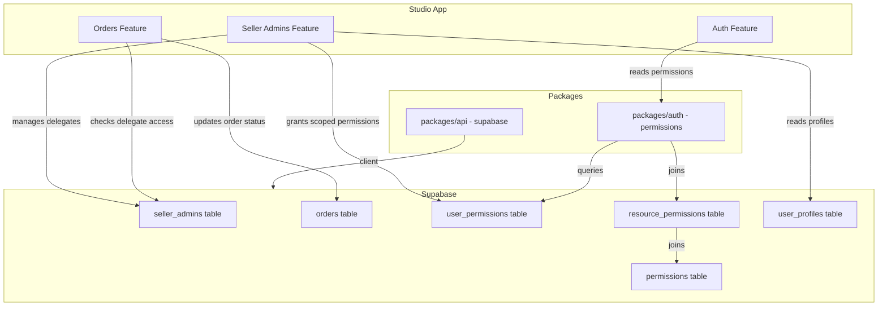
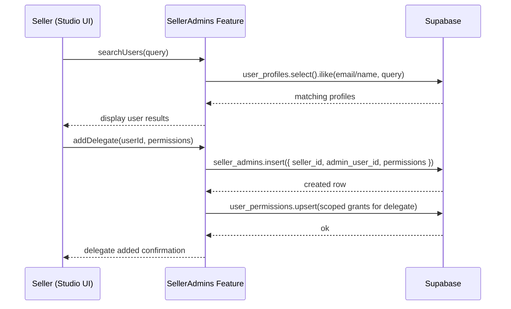
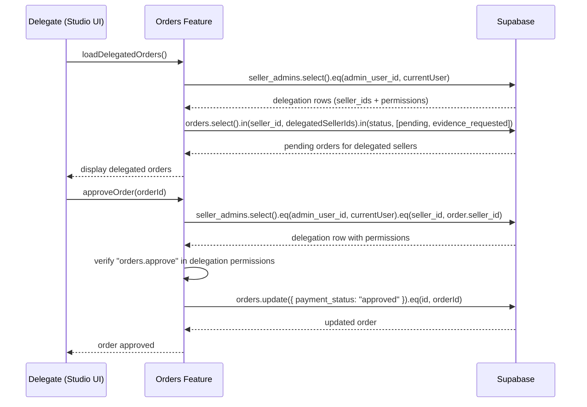
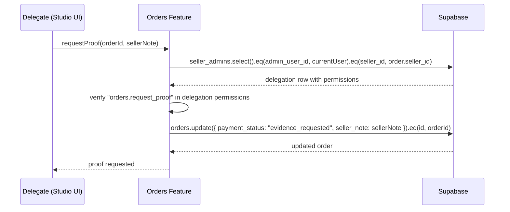

# Design Document: Seller Admin Delegation

## Overview

Seller Admin Delegation allows item owners (sellers) to designate other users as delegated administrators for their seller operations within the Studio app. Delegated admins can perform specific actions on behalf of the seller — primarily approving purchases and requesting additional proof before approving — without having full seller account access.

This feature introduces a `seller_admins` table that links a seller to one or more delegate users, each with a scoped set of permissions. The existing permission system (`permissions`, `resource_permissions`, `user_permissions`) is extended with new permission keys for delegation management and order approval actions. The Studio app gains a new `seller-admins` feature module following Clean Architecture conventions.

The design prioritizes security (sellers can only delegate their own orders, delegates can only act within their granted scope) and auditability (all delegation grants and order actions are traceable).

## Architecture



## Sequence Diagrams

### Seller Adds a Delegate



### Delegate Approves a Purchase



### Delegate Requests More Proof



## Components and Interfaces

### Component 1: SellerAdmins Feature Module

**Purpose**: Manages the lifecycle of delegated admin relationships — CRUD operations on `seller_admins` rows and the associated scoped permission grants.

**Interface**:

```typescript
// Domain types
interface SellerAdmin {
  id: string;
  seller_id: string;
  admin_user_id: string;
  permissions: DelegatePermission[];
  created_at: string;
  updated_at: string;
}

type DelegatePermission = "orders.approve" | "orders.request_proof";

interface DelegateWithProfile extends SellerAdmin {
  admin_profile: {
    id: string;
    email: string;
    display_name: string | null;
    avatar_url: string | null;
  };
}
```

**Responsibilities**:

- List current delegates for the authenticated seller
- Search users by email/name to add as delegates
- Add a delegate with selected permissions
- Update a delegate's permissions
- Remove a delegate and revoke associated permissions

### Component 2: Delegated Order Actions

**Purpose**: Extends the existing Orders feature to allow delegates to view and act on orders belonging to sellers who delegated to them.

**Interface**:

```typescript
interface DelegatedOrderContext {
  seller_id: string;
  seller_display_name: string | null;
  permissions: DelegatePermission[];
}

interface OrderAction {
  orderId: string;
  action: "approve" | "request_proof";
  seller_note?: string;
}
```

**Responsibilities**:

- Fetch orders for all sellers who delegated to the current user
- Verify delegate has the required permission before executing an action
- Approve orders on behalf of the seller
- Request additional proof with a seller note

### Component 3: Delegation Permission Guard

**Purpose**: Client-side hook that resolves the current user's delegation context — which sellers they represent and what actions they can perform.

**Interface**:

```typescript
interface UseDelegationContextReturn {
  delegations: DelegatedOrderContext[];
  isLoading: boolean;
  isDelegateFor: (sellerId: string) => boolean;
  canApprove: (sellerId: string) => boolean;
  canRequestProof: (sellerId: string) => boolean;
}
```

**Responsibilities**:

- Query `seller_admins` for rows where `admin_user_id` matches the current user
- Cache delegation context with TanStack Query
- Provide permission-check helpers scoped to a specific seller

## Data Models

### Table: `seller_admins`

```typescript
interface SellerAdminRow {
  id: string; // uuid, primary key, default gen_random_uuid()
  seller_id: string; // uuid, references user_profiles(id)
  admin_user_id: string; // uuid, references user_profiles(id)
  permissions: DelegatePermission[]; // text[], delegated permission keys
  created_at: string; // timestamptz, default now()
  updated_at: string; // timestamptz, default now()
}
```

**Validation Rules**:

- `seller_id` ≠ `admin_user_id` (a seller cannot delegate to themselves)
- `UNIQUE(seller_id, admin_user_id)` — one delegation row per seller-delegate pair
- `permissions` must be a non-empty subset of `["orders.approve", "orders.request_proof"]`
- `seller_id` must reference an existing user with the seller role/permissions

**RLS Policies**:

- SELECT: `auth.uid() = seller_id OR auth.uid() = admin_user_id`
- INSERT: `auth.uid() = seller_id`
- UPDATE: `auth.uid() = seller_id`
- DELETE: `auth.uid() = seller_id`

### New Permission Keys

```typescript
const DELEGATION_PERMISSION_KEYS = [
  "seller_admins.create", // Can add delegates
  "seller_admins.read", // Can view delegates
  "seller_admins.update", // Can update delegate permissions
  "seller_admins.delete", // Can remove delegates
  "orders.approve", // Can approve a purchase
  "orders.request_proof", // Can request more proof before approving
] as const;
```

### Permission Group Addition

```typescript
// Added to PERMISSION_GROUPS in constants
{
  key: "sellerAdmins",
  labelKey: "sellerAdmins",
  permissions: [
    "seller_admins.create",
    "seller_admins.read",
    "seller_admins.update",
    "seller_admins.delete",
    "orders.approve",
    "orders.request_proof",
  ],
}
```

## Key Functions with Formal Specifications

### Function 1: `fetchDelegates(supabase, sellerId)`

```typescript
async function fetchDelegates(
  supabase: SupabaseClient,
  sellerId: string,
): Promise<DelegateWithProfile[]>;
```

**Preconditions:**

- `sellerId` is a valid UUID referencing an existing user
- Authenticated user's `auth.uid()` equals `sellerId` (enforced by RLS)

**Postconditions:**

- Returns array of `DelegateWithProfile` objects for the given seller
- Each result includes the delegate's profile (email, display_name, avatar_url)
- Results are ordered by `created_at` ascending
- Empty array if no delegates exist

### Function 2: `addDelegate(supabase, sellerId, adminUserId, permissions)`

```typescript
async function addDelegate(
  supabase: SupabaseClient,
  sellerId: string,
  adminUserId: string,
  permissions: DelegatePermission[],
): Promise<SellerAdmin>;
```

**Preconditions:**

- `sellerId` ≠ `adminUserId`
- `permissions` is non-empty and contains only valid `DelegatePermission` values
- No existing row with the same `(seller_id, admin_user_id)` pair
- Authenticated user's `auth.uid()` equals `sellerId`

**Postconditions:**

- A new `seller_admins` row is inserted
- Returns the created `SellerAdmin` object
- If a duplicate pair exists, throws a unique constraint error

### Function 3: `removeDelegate(supabase, sellerId, adminUserId)`

```typescript
async function removeDelegate(
  supabase: SupabaseClient,
  sellerId: string,
  adminUserId: string,
): Promise<void>;
```

**Preconditions:**

- A `seller_admins` row exists for the given `(seller_id, admin_user_id)` pair
- Authenticated user's `auth.uid()` equals `sellerId`

**Postconditions:**

- The `seller_admins` row is deleted
- No orphaned permission grants remain for the delegate on this seller's resources

### Function 4: `fetchDelegatedOrders(supabase, delegateUserId)`

```typescript
async function fetchDelegatedOrders(
  supabase: SupabaseClient,
  delegateUserId: string,
): Promise<{ seller: DelegatedOrderContext; orders: Order[] }[]>;
```

**Preconditions:**

- `delegateUserId` is a valid UUID
- Authenticated user's `auth.uid()` equals `delegateUserId`

**Postconditions:**

- Returns orders grouped by seller, only for sellers who delegated to this user
- Only orders with `payment_status` in `["pending_verification", "evidence_requested"]` are included
- Each group includes the seller context (name, permissions granted to this delegate)
- Empty array if user has no delegations

### Function 5: `executeDelegateAction(supabase, delegateUserId, action)`

```typescript
async function executeDelegateAction(
  supabase: SupabaseClient,
  delegateUserId: string,
  action: OrderAction,
): Promise<void>;
```

**Preconditions:**

- A `seller_admins` row exists where `admin_user_id = delegateUserId` and `seller_id` matches the order's `seller_id`
- The delegation's `permissions` array includes the required permission for the action:
  - `"approve"` requires `"orders.approve"`
  - `"request_proof"` requires `"orders.request_proof"`
- The order's current `payment_status` is `"pending_verification"` or `"evidence_requested"`
- If action is `"request_proof"`, `action.seller_note` must be a non-empty string

**Postconditions:**

- For `"approve"`: order's `payment_status` is updated to `"approved"`
- For `"request_proof"`: order's `payment_status` is updated to `"evidence_requested"` and `seller_note` is set
- No state change occurs if preconditions are not met (throws error)

**Loop Invariants:** N/A

## Algorithmic Pseudocode

### Delegate Addition Algorithm

```typescript
// ALGORITHM: addDelegateWorkflow
// INPUT: sellerId (UUID), adminUserId (UUID), permissions (DelegatePermission[])
// OUTPUT: SellerAdmin

async function addDelegateWorkflow(
  supabase: SupabaseClient,
  sellerId: string,
  adminUserId: string,
  permissions: DelegatePermission[],
): Promise<SellerAdmin> {
  // Step 1: Validate inputs
  if (sellerId === adminUserId) {
    throw new Error("Cannot delegate to yourself");
  }
  if (permissions.length === 0) {
    throw new Error("At least one permission is required");
  }

  // Step 2: Verify target user exists
  const profile = await supabase
    .from("user_profiles")
    .select("id")
    .eq("id", adminUserId)
    .single();
  if (profile.error) {
    throw new Error("User not found");
  }

  // Step 3: Insert delegation row
  const { data, error } = await supabase
    .from("seller_admins")
    .insert({
      seller_id: sellerId,
      admin_user_id: adminUserId,
      permissions,
    })
    .select()
    .single();

  if (error) throw error;

  return data as SellerAdmin;
}
```

### Delegate Order Action Algorithm

```typescript
// ALGORITHM: executeDelegateOrderAction
// INPUT: delegateUserId (UUID), orderId (UUID), action ("approve" | "request_proof"), sellerNote? (string)
// OUTPUT: void (order updated)

async function executeDelegateOrderAction(
  supabase: SupabaseClient,
  delegateUserId: string,
  orderId: string,
  action: "approve" | "request_proof",
  sellerNote?: string,
): Promise<void> {
  // Step 1: Fetch the target order
  const { data: order, error: orderError } = await supabase
    .from("orders")
    .select("id, seller_id, payment_status")
    .eq("id", orderId)
    .single();

  if (orderError || !order) {
    throw new Error("Order not found");
  }

  // Step 2: Verify order is in an actionable state
  const actionableStatuses = ["pending_verification", "evidence_requested"];
  if (!actionableStatuses.includes(order.payment_status)) {
    throw new Error("Order is not in an actionable state");
  }

  // Step 3: Verify delegation exists and has required permission
  const requiredPermission: DelegatePermission =
    action === "approve" ? "orders.approve" : "orders.request_proof";

  const { data: delegation, error: delegationError } = await supabase
    .from("seller_admins")
    .select("permissions")
    .eq("admin_user_id", delegateUserId)
    .eq("seller_id", order.seller_id)
    .single();

  if (delegationError || !delegation) {
    throw new Error("No delegation found for this seller");
  }

  if (!delegation.permissions.includes(requiredPermission)) {
    throw new Error(`Missing required permission: ${requiredPermission}`);
  }

  // Step 4: Execute the action
  if (action === "approve") {
    const { error } = await supabase
      .from("orders")
      .update({ payment_status: "approved" })
      .eq("id", orderId);
    if (error) throw error;
  } else {
    if (!sellerNote?.trim()) {
      throw new Error("Seller note is required when requesting proof");
    }
    const { error } = await supabase
      .from("orders")
      .update({
        payment_status: "evidence_requested",
        seller_note: sellerNote.trim(),
      })
      .eq("id", orderId);
    if (error) throw error;
  }
}
```

## Example Usage

```typescript
// Example 1: Seller adds a delegate from the Studio UI
const supabase = createBrowserSupabaseClient();
const { data: { user } } = await supabase.auth.getUser();

const delegate = await addDelegateWorkflow(
  supabase,
  user.id,                                    // seller's own ID
  "delegate-user-uuid",                       // target user
  ["orders.approve", "orders.request_proof"], // full delegation
);

// Example 2: Delegate views orders they can act on
const delegatedOrders = await fetchDelegatedOrders(supabase, currentUser.id);
// Returns: [{ seller: { seller_id, seller_display_name, permissions }, orders: [...] }]

// Example 3: Delegate approves an order
await executeDelegateAction(supabase, currentUser.id, {
  orderId: "order-uuid",
  action: "approve",
});

// Example 4: Delegate requests more proof
await executeDelegateAction(supabase, currentUser.id, {
  orderId: "order-uuid",
  action: "request_proof",
  seller_note: "Please upload a clearer photo of the payment receipt.",
});

// Example 5: Using the delegation context hook in a component
function DelegatedOrdersPage() {
  const { delegations, isLoading, canApprove } = useDelegationContext();

  if (isLoading) return <Spinner />;
  if (delegations.length === 0) return <EmptyState />;

  return delegations.map(({ seller, orders }) => (
    <SellerOrderGroup
      key={seller.seller_id}
      seller={seller}
      orders={orders}
      showApproveButton={canApprove(seller.seller_id)}
    />
  ));
}
```

## Correctness Properties

The following properties must hold for the delegation system:

1. **Self-delegation prevention**: For all users U, `addDelegate(U.id, U.id, perms)` must fail. A seller cannot be their own delegate.

2. **Permission scope containment**: For all delegates D acting on order O belonging to seller S, the action succeeds only if there exists a `seller_admins` row where `admin_user_id = D.id AND seller_id = S.id` and the row's `permissions` array contains the required permission key.

3. **Seller-only management**: For all `seller_admins` rows R, only the user where `auth.uid() = R.seller_id` can INSERT, UPDATE, or DELETE that row. Delegates cannot modify their own delegation.

4. **Unique delegation pairs**: For all sellers S and delegates D, at most one `seller_admins` row exists with `(seller_id = S.id, admin_user_id = D.id)`.

5. **Actionable state guard**: `executeDelegateAction` succeeds only when the target order's `payment_status` is in `["pending_verification", "evidence_requested"]`. Orders in terminal states (`approved`, `rejected`) cannot be acted upon.

6. **Proof request requires note**: When `action = "request_proof"`, the `seller_note` field must be a non-empty string. The system must reject requests with empty or missing notes.

7. **Delegation removal cascades access**: After `removeDelegate(S.id, D.id)`, delegate D can no longer view or act on any of seller S's orders. Subsequent calls to `fetchDelegatedOrders` for D must not include S's orders.

8. **Read visibility symmetry**: Both the seller (`seller_id`) and the delegate (`admin_user_id`) can SELECT their shared `seller_admins` row, but only the seller can mutate it.

## Error Handling

### Error Scenario 1: Self-Delegation Attempt

**Condition**: Seller tries to add themselves as a delegate (`sellerId === adminUserId`)
**Response**: Throw validation error before database call; display user-facing message "You cannot delegate to yourself"
**Recovery**: No state change; user corrects the selection

### Error Scenario 2: Duplicate Delegation

**Condition**: Seller tries to add a user who is already a delegate (unique constraint violation)
**Response**: Catch Supabase unique constraint error; display "This user is already a delegate"
**Recovery**: Offer to update the existing delegate's permissions instead

### Error Scenario 3: Unauthorized Delegate Action

**Condition**: Delegate attempts an action not in their `permissions` array
**Response**: Throw permission error; display "You don't have permission to perform this action"
**Recovery**: No state change; delegate contacts seller to request additional permissions

### Error Scenario 4: Order Not Actionable

**Condition**: Delegate tries to approve/request proof on an order that's already approved or rejected
**Response**: Throw state error; display "This order has already been processed"
**Recovery**: Refresh order list to reflect current state

### Error Scenario 5: Delegate User Not Found

**Condition**: Seller searches for a user to delegate to, but the email/name doesn't match any profile
**Response**: Display empty search results with "No users found"
**Recovery**: Seller verifies the email/name and retries

## Testing Strategy

### Unit Testing Approach

- Test all domain validation functions (self-delegation check, permission validation, actionable state check)
- Test infrastructure query functions with mocked Supabase client
- Test hooks (`useDelegates`, `useDelegationContext`, `useDelegateActions`) with TanStack Query test utilities
- Test presentation components with Testing Library (delegate list, add delegate form, action buttons)
- Coverage goal: ≥80% for domain and application layers

### Property-Based Testing Approach

**Property Test Library**: fast-check

- **Self-delegation invariant**: For any generated UUID, `addDelegate(uuid, uuid, perms)` always throws
- **Permission containment**: For any generated delegation with permissions P and action requiring permission Q, the action succeeds iff Q ∈ P
- **Unique pair constraint**: For any sequence of add/remove operations on the same (seller, delegate) pair, at most one active row exists at any point

### Integration Testing Approach

- Test full delegation lifecycle: add delegate → delegate views orders → delegate approves → seller verifies
- Test RLS policies: verify delegate cannot modify their own delegation row
- Test permission revocation: remove delegate → verify access is revoked
- Use Supabase local instance for integration tests

## Security Considerations

- **Row Level Security (RLS)**: All `seller_admins` operations are protected by RLS policies. Sellers can only manage their own delegations; delegates can only read delegations where they are the `admin_user_id`.
- **Server-side permission verification**: Even though the UI checks permissions client-side, the `executeDelegateAction` function re-verifies delegation and permissions before mutating order state.
- **No privilege escalation**: Delegates cannot grant themselves additional permissions or delegate to others. Only the original seller can manage delegations.
- **Audit trail**: The `created_at` and `updated_at` timestamps on `seller_admins` provide basic auditability. Order status changes are tracked by the existing order audit mechanism.
- **Input sanitization**: User search queries are escaped to prevent SQL injection via Supabase's `ilike` filter (following the existing `escapeLikePattern` utility).

## Dependencies

- **Supabase**: Database, Auth, RLS — existing dependency
- **TanStack Query**: Server state management for delegation queries — existing dependency
- **packages/auth**: `useCurrentUserPermissions()` and `matchesPermissions()` — existing dependency
- **fast-check**: Property-based testing library — new dev dependency (if not already present)
- **Database migration**: New `seller_admins` table, new permission rows in `permissions` and `resource_permissions` tables
