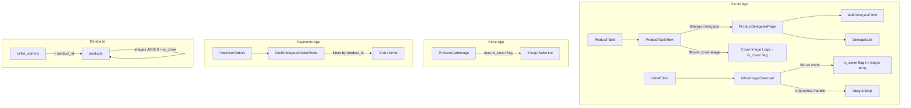
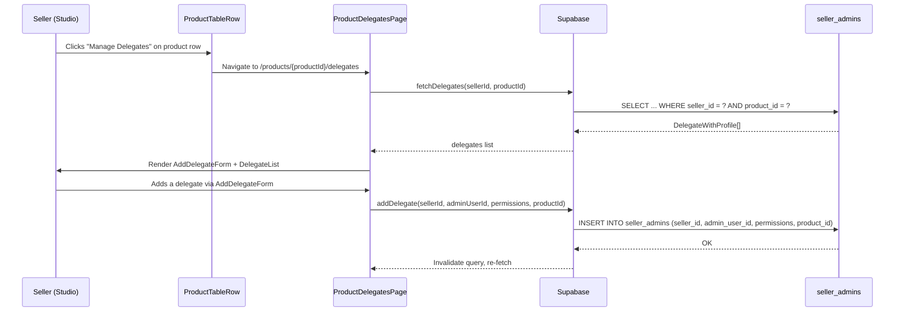
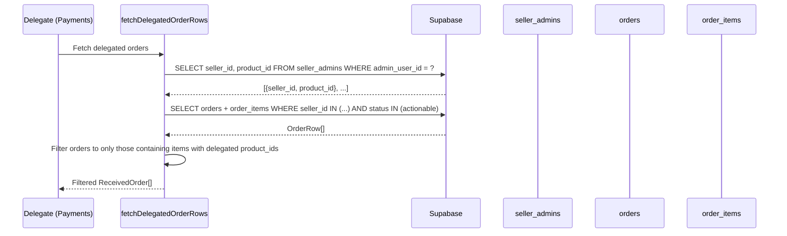
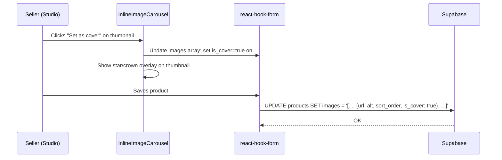
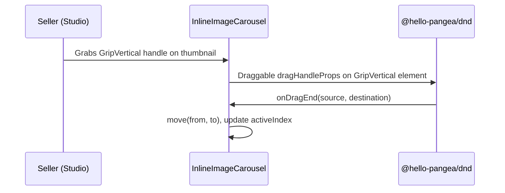

# Design Document: Studio UX Improvements

## Overview

This feature delivers three targeted UX improvements to the Studio seller dashboard:

1. **Delegate UX Redesign** — Replaces the global `/delegates` page and `DelegateNav` with per-product delegation. A "Manage Delegates" button appears on each product row, navigating to `/products/{productId}/delegates`. The `seller_admins` table gains a `product_id` column so delegates are scoped per product, and the Payments app filters delegated orders by product.

2. **Cover Image Selection** — Adds an `is_cover` boolean field to image objects in the existing JSONB `images` array (no DB migration needed). The `InlineImageCarousel` gains a "Set as cover" button per thumbnail with a visual indicator. The store product listing and Studio product table both find the image with `is_cover: true` instead of always using `images[0]`. The Zod schema enforces at most one image has `is_cover: true`.

3. **Carousel Image Reordering with GripVertical** — The `InlineImageCarousel` already supports drag-and-drop via `@hello-pangea/dnd`, but thumbnails use the entire element as the drag handle. This improvement adds a visible `GripVertical` drag handle to each thumbnail, matching the pattern used by sections (`SectionCard`) and section items (`SectionItemsCards`, `SectionItemsTwoColumn`, etc.).

No backwards compatibility is required — all databases will be wiped and re-seeded.

## Architecture



## Sequence Diagrams

### Improvement 1: Per-Product Delegate Management



### Improvement 1b: Delegated Order Filtering by Product



### Improvement 2: Cover Image Selection



### Improvement 3: Carousel GripVertical Handle



## Components and Interfaces

### Component 1: ProductTableRow (Modified)

**Purpose**: Renders a single product row in the product table. Modified to show a "Manage Delegates" button and a delegate indicator badge, plus use cover image for thumbnail.

**Interface**:

```typescript
interface ProductTableRowProps {
  product: Product;
  isOddRow: boolean;
  canReorder: boolean;
  canUpdate: boolean;
  canDelete: boolean;
  dragProvided: DraggableProvided;
  isDragging: boolean;
  delegateCount?: number; // NEW: number of delegates for this product
}
```

**Responsibilities**:

- Show cover image thumbnail using `getCoverImage(product.images, product.cover_image_index)`
- Show a `Users` icon badge next to product name when `delegateCount > 0`
- Render a "Manage Delegates" button in the actions column that links to `/products/{productId}/delegates`

### Component 2: ProductDelegatesPage (New)

**Purpose**: Per-product delegate management page at `/products/{productId}/delegates`.

**Interface**:

```typescript
interface ProductDelegatesPageProps {
  productId: string;
}
```

**Responsibilities**:

- Fetch delegates scoped to the given product via `useDelegates(sellerId, productId)`
- Render `AddDelegateForm` and `DelegateList` scoped to the product
- Show product name in the page header for context
- Permission-gate behind `seller_admins.read`

### Component 3: InlineImageCarousel (Modified)

**Purpose**: Image carousel in the inline product editor. Modified to support cover image selection and GripVertical drag handles.

**Interface**:

```typescript
interface InlineImageCarouselProps {
  control: Control<ProductFormValues>;
}
```

**Responsibilities**:

- Render a "Set as cover" button (star icon) on each thumbnail
- Show a visual indicator (filled star overlay) on the current cover image thumbnail
- Use `GripVertical` as the drag handle instead of the entire thumbnail
- Separate `dragHandleProps` from the thumbnail button element

### Component 4: ProductCardImage (Modified — Store App)

**Purpose**: Product card image in the store listing. Modified to use cover image.

**Responsibilities**:

- Use `getCoverImageUrl(product.images, product.cover_image_index)` instead of `getFirstImageUrl(product.images)`

## Data Models

### seller_admins Table (Modified)

```typescript
interface SellerAdmin {
  id: string; // uuid, PK
  seller_id: string; // uuid, FK → user_profiles
  admin_user_id: string; // uuid, FK → user_profiles
  product_id: string; // uuid, FK → products (NEW)
  permissions: DelegatePermission[];
  created_at: string;
  updated_at: string;
}
```

**Validation Rules**:

- `seller_id <> admin_user_id` (no self-delegation)
- UNIQUE constraint on `(seller_id, admin_user_id, product_id)` — one delegation per seller-delegate-product triple
- `product_id` references `products(id) ON DELETE CASCADE`
- RLS policies updated to include `product_id` in all conditions

### products Table — Image Schema (Modified)

The existing `ProductImage` Zod schema is extended with an optional `is_cover` boolean:

```typescript
// Extended ProductImage type
interface ProductImage {
  url: string;
  alt: string;
  sort_order: number;
  is_cover?: boolean; // NEW: true for the cover image, undefined/false for others
}
```

**Validation Rules**:

- At most one image in the array may have `is_cover: true`
- If no image has `is_cover: true`, the first image (index 0) is used as cover
- `is_cover` is optional — existing products without it work unchanged (fallback to first image)
- No DB migration needed — the field lives inside the existing JSONB `images` column

### DelegateWithProfile (Modified)

```typescript
interface DelegateWithProfile extends SellerAdmin {
  admin_profile: {
    id: string;
    email: string;
    display_name: string | null;
    avatar_url: string | null;
  };
}
```

## Algorithmic Pseudocode

### Algorithm 1: Get Cover Image URL

```typescript
function getCoverImageUrl(images: unknown): string | null {
  if (!Array.isArray(images) || images.length === 0) return null;

  // Find the image marked as cover, or fall back to first
  const coverImage =
    (images as ProductImage[]).find((img) => img.is_cover === true) ??
    images[0];

  if (typeof coverImage === "string") return coverImage;
  if (coverImage && typeof coverImage === "object" && "url" in coverImage) {
    return String((coverImage as { url: string }).url);
  }
  return null;
}
```

**Preconditions:**

- `images` may be any value (JSONB from Supabase)

**Postconditions:**

- Returns the URL of the image with `is_cover: true`, or the first image if none is marked
- Returns null if images array is empty or invalid
- No mutations to input

### Algorithm 1b: Set Cover Image in Form

```typescript
function setCoverImage(
  images: ProductImage[],
  coverIndex: number,
): ProductImage[] {
  return images.map((img, i) => ({
    ...img,
    is_cover: i === coverIndex,
  }));
}
```

**Preconditions:**

- `images` is a valid array of ProductImage objects
- `coverIndex` is within `[0, images.length - 1]`

**Postconditions:**

- Exactly one image in the returned array has `is_cover: true`
- All other images have `is_cover: false`
- Original array is not mutated

### Algorithm 2: Filter Delegated Orders by Product

```typescript
async function fetchDelegatedOrderRows(
  supabase: SupabaseClient,
  userId: string,
  filter?: string,
): Promise<{ rows: OrderRow[]; sellerNameMap: Record<string, string> }> {
  // Step 1: Fetch delegations with product_id
  const { data: delegations } = await supabase
    .from("seller_admins")
    .select("seller_id, product_id")
    .eq("admin_user_id", userId);

  const delegatedSellerIds = [
    ...new Set(delegations?.map((d) => d.seller_id) ?? []),
  ];
  const delegatedProductIds = new Set(
    delegations?.map((d) => d.product_id) ?? [],
  );

  if (delegatedSellerIds.length === 0) return { rows: [], sellerNameMap: {} };

  // Step 2: Fetch actionable orders from those sellers
  const { data } = await supabase
    .from("orders")
    .select(ORDER_SELECT)
    .in("seller_id", delegatedSellerIds)
    .in("payment_status", ACTIONABLE_STATUSES)
    .order("created_at", { ascending: false });

  const allRows = (data ?? []) as OrderRow[];

  // Step 3: Filter to only orders containing items for delegated products
  const filteredRows = allRows.filter((row) =>
    row.order_items.some((item) => delegatedProductIds.has(item.product_id)),
  );

  // Step 4: Resolve seller names
  const sellerNameMap =
    filteredRows.length > 0
      ? await fetchUserDisplayNames(supabase, delegatedSellerIds, "Seller")
      : {};

  return { rows: filteredRows, sellerNameMap };
}
```

**Preconditions:**

- `userId` is a valid authenticated user ID
- User has at least one row in `seller_admins` as `admin_user_id`

**Postconditions:**

- Returns only orders that contain at least one item matching a delegated `product_id`
- `sellerNameMap` contains display names for all sellers in the result set

**Loop Invariants:**

- For the filter step: all previously checked orders either match or are excluded

### Algorithm 3: Handle Cover Flag on Drag Reorder

```typescript
// No special handling needed — the is_cover flag travels with the image object
// When images are reordered via move(from, to), the is_cover boolean stays
// on the same image object. No index recalculation required.
```

**Preconditions:**

- Images array contains objects with `is_cover` flag
- Reorder is performed via `useFieldArray.move(from, to)`

**Postconditions:**

- The image with `is_cover: true` retains its flag after reorder
- No additional logic needed (flag is part of the object, not a separate index)

## Key Functions with Formal Specifications

### Function 1: fetchDelegates (Modified)

```typescript
function fetchDelegates(
  supabase: SupabaseClient,
  sellerId: string,
  productId: string,
): Promise<DelegateWithProfile[]>;
```

**Preconditions:**

- `sellerId` is a valid UUID of the authenticated seller
- `productId` is a valid UUID of an existing product owned by the seller

**Postconditions:**

- Returns delegates scoped to the given `(sellerId, productId)` pair
- Each delegate includes joined `admin_profile` data
- Results ordered by `created_at` ascending

### Function 2: addDelegate (Modified)

```typescript
function addDelegate(
  supabase: SupabaseClient,
  sellerId: string,
  adminUserId: string,
  permissions: DelegatePermission[],
  productId: string,
): Promise<void>;
```

**Preconditions:**

- `sellerId !== adminUserId` (no self-delegation)
- `permissions` is non-empty
- `productId` references a product owned by `sellerId`
- No existing row with same `(sellerId, adminUserId, productId)` triple

**Postconditions:**

- A new row is inserted into `seller_admins` with the given `product_id`
- RLS ensures only the seller can perform this insert

### Function 3: getCoverImageUrl

```typescript
function getCoverImageUrl(images: unknown): string | null;
```

**Preconditions:**

- `images` is the raw JSONB value from the products table

**Postconditions:**

- Returns the URL of the image with `is_cover: true`, or the first image if none marked
- Returns null if images array is empty or invalid

### Function 4: setCoverImage

```typescript
function setCoverImage(
  images: ProductImage[],
  coverIndex: number,
): ProductImage[];
```

**Preconditions:**

- `images` is a valid array of ProductImage objects
- `coverIndex` is within `[0, images.length - 1]`

**Postconditions:**

- Returns a new array where exactly one image has `is_cover: true`
- All other images have `is_cover: false`
- Original array is not mutated

## Example Usage

```typescript
// === Improvement 1: Per-product delegate management ===

// In ProductTableRow — "Manage Delegates" button
<Link href={`/products/${product.id}/delegates`}>
  <Button variant="outline" size="sm" {...tid(`manage-delegates-${product.id}`)}>
    <Users className="size-3.5" />
  </Button>
</Link>

// Delegate badge next to product name
{delegateCount > 0 && (
  <Users className="size-3.5 text-muted-foreground" aria-label={t("products.hasDelegates")} />
)}

// In ProductDelegatesPage
const { data: delegates } = useDelegates(sellerId, productId);
<AddDelegateForm onAdd={(userId, perms) => addMutation.mutate({ sellerId, adminUserId: userId, permissions: perms, productId })} />
<DelegateList delegates={delegates} onRemove={handleRemove} />

// === Improvement 2: Cover image selection ===

// In InlineImageCarousel — "Set as cover" button on thumbnail
const handleSetCover = (index: number) => {
  const updated = images.map((img, i) => ({ ...img, is_cover: i === index }));
  setValue("images", updated);
};

<button
  type="button"
  onClick={() => handleSetCover(index)}
  aria-label={t("setAsCover")}
>
  <Star className={cn("size-3", image.is_cover ? "fill-current text-yellow-500" : "text-muted-foreground")} />
</button>

// In ProductCardImage (store) — use cover image
const imageUrl = getCoverImageUrl(product.images);

// In ProductTableRow (studio) — use cover image
const imageUrl = getCoverImageUrl(product.images);

// === Improvement 3: GripVertical on carousel thumbnails ===

// In InlineImageCarousel — separate drag handle from thumbnail
<Draggable key={field.id} draggableId={field.id} index={index}>
  {(dragProvided) => (
    <div ref={dragProvided.innerRef} {...dragProvided.draggableProps} className="relative group flex items-center gap-1">
      <div {...dragProvided.dragHandleProps} className="cursor-grab text-muted-foreground hover:text-foreground">
        <GripVertical className="size-3" />
      </div>
      {renderThumbContent(field, index)}
    </div>
  )}
</Draggable>
```

## Correctness Properties

1. **∀ product p, ∀ delegate d**: If `d` is delegated for `p`, then `seller_admins` contains exactly one row with `(d.seller_id, d.admin_user_id, p.id)`.

2. **∀ product p**: `getCoverImageUrl(p.images)` returns the URL of the image with `is_cover: true`, or `p.images[0]?.url` if no image is marked as cover.

3. **∀ reorder operation**: Since `is_cover` is a property of the image object itself, reordering via `move(from, to)` preserves the cover flag on the correct image without any index recalculation.

4. **∀ delegated order visible to delegate d**: The order contains at least one `order_item` whose `product_id` matches a `product_id` in `d`'s `seller_admins` rows.

5. **∀ seller s, ∀ product p**: A seller cannot delegate to themselves for any product (`seller_id <> admin_user_id` constraint).

6. **∀ thumbnail in InlineImageCarousel**: The drag handle is a `GripVertical` icon element with `dragHandleProps`, not the entire thumbnail.

## Error Handling

### Error Scenario 1: No Cover Image Marked

**Condition**: No image in the array has `is_cover: true` (e.g., legacy products, or all images deleted and re-added)
**Response**: `getCoverImageUrl` falls back to the first image (index 0) silently
**Recovery**: User can set a cover image at any time; no data loss

### Error Scenario 2: Duplicate Delegation Attempt

**Condition**: Seller tries to add the same delegate for the same product twice
**Response**: Supabase UNIQUE constraint violation → mutation error displayed via toast
**Recovery**: User sees error message, existing delegation remains unchanged

### Error Scenario 3: Product Deleted While Viewing Delegates

**Condition**: Product is deleted while the delegate management page is open
**Response**: `ON DELETE CASCADE` removes all `seller_admins` rows for that product; query returns empty
**Recovery**: Page shows empty state; user navigates back to product list

### Error Scenario 4: Drag Reorder with Cover Image

**Condition**: User drags the cover image thumbnail to a new position
**Response**: The `is_cover` flag travels with the image object — no recalculation needed
**Recovery**: Cover image indicator stays on the correct thumbnail after reorder automatically

## Testing Strategy

### Unit Testing Approach

- `getCoverImageUrl`: Test with image having `is_cover: true`, no image marked, empty array, non-array input, string images, object images
- `setCoverImage`: Test setting cover on various indices, verify exactly one `is_cover: true` in result, verify immutability
- `fetchDelegates` with `productId` parameter: Mock Supabase client, verify `.eq("product_id", productId)` is called
- `fetchDelegatedOrderRows` product filtering: Mock orders with mixed product_ids, verify only matching orders returned
- `ProductDelegatesPage`: Render with mocked hooks, verify AddDelegateForm and DelegateList receive correct productId-scoped data

### Property-Based Testing Approach

**Property Test Library**: fast-check

- **Cover image flag integrity**: For any `images` array and any `coverIndex`, `setCoverImage(images, coverIndex)` produces an array where exactly one element has `is_cover: true` and it's at position `coverIndex`
- **Cover image URL resolution**: For any `images` array with at most one `is_cover: true`, `getCoverImageUrl` returns the URL of the marked image, or the first image if none marked
- **Reorder preserves cover**: For any reorder operation `move(from, to)` on an images array, the image with `is_cover: true` retains its flag (since it's a property of the object)
- **Delegate uniqueness**: For any sequence of `addDelegate` calls with the same `(sellerId, adminUserId, productId)`, only one row exists in the table

### Integration Testing Approach

- E2E test: Navigate to product table → click "Manage Delegates" → verify navigation to `/products/{id}/delegates`
- E2E test: Add a delegate for a product → verify delegate appears in list → verify delegate badge appears on product row
- E2E test: Set cover image → save product → verify store listing shows correct image
- E2E test: Drag carousel thumbnail via GripVertical handle → verify reorder persists

## Performance Considerations

- The delegate count per product requires an additional query or a count join. Use a single batch query `SELECT product_id, COUNT(*) FROM seller_admins WHERE seller_id = ? GROUP BY product_id` to avoid N+1 queries in the product table.
- Cover image uses an `is_cover` boolean flag inside the existing JSONB images array — no additional column or query overhead.
- The product filtering in `fetchDelegatedOrderRows` is done client-side after fetching orders. For sellers with many orders, consider adding a database-level join or subquery. Current volume is low enough that client-side filtering is acceptable.

## Security Considerations

- RLS policies on `seller_admins` must include `product_id` in all conditions to prevent a delegate from seeing delegations for products they're not assigned to.
- The `orders_delegate_read` and `orders_delegate_update` policies must be updated to join through `order_items` and verify the delegate has a `seller_admins` row matching the `product_id` of at least one item in the order.
- `is_cover` flag is a simple boolean inside the JSONB images array with no security implications beyond normal product update permissions.

## Dependencies

- `@hello-pangea/dnd` — existing, used for drag-and-drop (GripVertical handle change)
- `lucide-react` — existing, provides `GripVertical`, `Users`, `Star` icons
- `@tanstack/react-query` — existing, for delegate query hooks
- `next-intl` — existing, for i18n
- `shadcn/ui` — existing, for Button, Badge components
- `supabase` — existing, database and RLS
