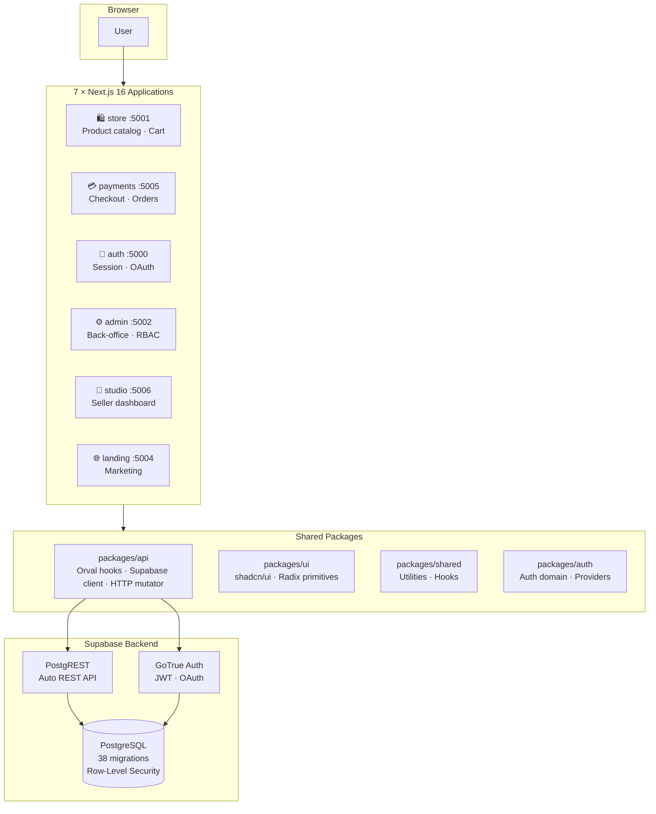

<div align="center">

<br>

```
 ██████╗ █████╗ ███╗   ██╗██████╗ ██╗   ██╗███████╗████████╗ ██████╗ ██████╗ ███████╗
██╔════╝██╔══██╗████╗  ██║██╔══██╗╚██╗ ██╔╝██╔════╝╚══██╔══╝██╔═══██╗██╔══██╗██╔════╝
██║     ███████║██╔██╗ ██║██║  ██║ ╚████╔╝ ███████╗   ██║   ██║   ██║██████╔╝█████╗
██║     ██╔══██║██║╚████║ ██║  ██║  ╚██╔╝  ╚════██║   ██║   ██║   ██║██╔══██╗██╔══╝
╚██████╗██║  ██║██║ ╚███║ ██████╔╝   ██║   ███████║   ██║   ╚██████╔╝██║  ██║███████╗
 ╚═════╝╚═╝  ╚═╝╚═╝  ╚══╝ ╚═════╝    ╚═╝   ╚══════╝   ╚═╝    ╚═════╝ ╚═╝  ╚═╝╚══════╝
```

### Multi-seller marketplace · products, tickets, services & digital goods

<br>

[](https://nextjs.org/)
[](https://react.dev/)
[](https://www.typescriptlang.org/)
[](https://tailwindcss.com/)
[](https://supabase.com/)
[](https://pnpm.io/)

[](.github/workflows/)
[](https://playwright.dev/)
[](https://vitest.dev/)
[](https://docker.com/)
[](package.json)

<br>

</div>

---

## ◆ What Is This?

**Libra** is a production-grade, full-stack multi-seller marketplace built as a **pnpm monorepo** with seven Next.js 16 applications sharing a unified Supabase backend.

It handles the complete commerce lifecycle — product discovery, cart management, multi-seller checkout, payment method selection, order fulfillment, seller analytics, and operator administration — all from a single codebase.

### Why it exists

Most e-commerce solutions are either locked-in SaaS platforms or over-engineered enterprise systems. Libra is purpose-built for **community marketplaces**: conventions, events, clubs, and collectives where multiple independent sellers operate inside a single storefront, each with their own products, payment configurations, and order management — while the platform operator maintains granular control via a flexible permission system.

---

## ◆ Application Map

Seven Next.js applications, one nginx reverse proxy.

| App            |  Port   |  Audience  | Purpose                                       |
| -------------- | :-----: | :--------: | --------------------------------------------- |
| **auth**       | `:5000` |    All     | Login, signup, Google & Discord OAuth         |
| **store**      | `:5001` |   Buyers   | Product catalog, search, filtering, cart      |
| **admin**      | `:5002` | Operators  | Orders, inventory, users, permissions         |
| **playground** | `:5003` | Developers | Incubation sandbox — never delete             |
| **landing**    | `:5004` |   Public   | Marketing page                                |
| **payments**   | `:5005` |   Buyers   | Checkout, payment selection, order submission |
| **studio**     | `:5006` |  Sellers   | Product management, payment setup, reports    |

---

## ◆ Architecture



### Clean Architecture inside every app

Dependencies flow inward only: `Presentation → Application → Domain ← Infrastructure`

```
apps/[app]/src/
├── app/                     ← Next.js App Router  (routing only — thin wrappers)
├── features/[feature]/
│   ├── domain/              ← Types · Interfaces · Business rules · Constants
│   ├── application/         ← React hooks · Use cases · State
│   ├── infrastructure/      ← API calls · Supabase queries · Storage
│   └── presentation/        ← React components · Pages
└── shared/                  ← Cross-feature utilities within this app
```

---

## ◆ Technology Stack

<details>
<summary><strong>Core Runtime</strong></summary>

| Technology | Version | Role                                     |
| ---------- | :-----: | ---------------------------------------- |
| Node.js    |   22+   | Runtime                                  |
| pnpm       |   10    | Monorepo package manager                 |
| Turbo      |   2.x   | Task orchestration                       |
| Next.js    |   16    | React framework with App Router          |
| React      |   19    | UI library                               |
| TypeScript |    6    | Type safety across all apps and packages |

</details>

<details>
<summary><strong>UI & Styling</strong></summary>

| Technology      | Role                                                                |
| --------------- | ------------------------------------------------------------------- |
| Tailwind CSS v4 | Utility-first CSS — CSS-first configuration (no tailwind.config.js) |
| shadcn/ui       | Copy-paste component library                                        |
| Radix UI        | Accessible, unstyled primitive components                           |
| Lucide React    | Icon library                                                        |
| tw-animate-css  | CSS animation utilities                                             |

</details>

<details>
<summary><strong>Data, State & Forms</strong></summary>

| Technology      | Role                                                        |
| --------------- | ----------------------------------------------------------- |
| Supabase        | PostgreSQL + Auth + PostgREST API                           |
| TanStack Query  | Server state — caching, synchronization, background refresh |
| Orval           | Generates type-safe React Query hooks from OpenAPI spec     |
| Axios           | HTTP client with custom auth mutator                        |
| nuqs            | Type-safe URL search params (filters, pagination, tabs)     |
| React Hook Form | Performant forms                                            |
| Zod             | Schema validation                                           |

</details>

<details>
<summary><strong>Authentication</strong></summary>

| Technology             | Role                                      |
| ---------------------- | ----------------------------------------- |
| Supabase Auth (GoTrue) | Session management, JWT tokens            |
| Google OAuth           | Social login                              |
| Discord OAuth          | Social login                              |
| PostgreSQL RLS         | Database-enforced row-level authorization |

</details>

<details>
<summary><strong>Testing</strong></summary>

| Technology      | Role                                |
| --------------- | ----------------------------------- |
| Vitest          | Unit + component testing            |
| Playwright      | End-to-end browser testing          |
| Testing Library | React component testing utilities   |
| MSW             | Mock Service Worker for API mocking |
| @faker-js/faker | Synthetic test data generation      |

</details>

<details>
<summary><strong>Code Quality (13+ tools)</strong></summary>

| Tool       | Role                                                                           |
| ---------- | ------------------------------------------------------------------------------ |
| ESLint     | Linting with 13+ plugins: security, a11y, unicorn, sonarjs, tanstack, i18next… |
| Prettier   | Code formatting                                                                |
| Stylelint  | CSS linting + cross-app sync validation                                        |
| Secretlint | Secret detection in source files                                               |
| Semgrep    | SAST — OWASP Top 10, CI, security-audit rule sets                              |
| Husky      | Git hooks                                                                      |
| knip       | Unused exports and dependencies detection                                      |
| madge      | Circular dependency detection                                                  |
| jscpd      | Copy-paste detection                                                           |
| cspell     | Spell checking in source code                                                  |
| sherif     | Monorepo dependency conflicts                                                  |
| syncpack   | Lockfile consistency across packages                                           |
| ls-lint    | File and folder naming convention enforcement                                  |

</details>

<details>
<summary><strong>Infrastructure</strong></summary>

| Technology        | Role                                                        |
| ----------------- | ----------------------------------------------------------- |
| Docker            | Containerized production and staging deployment             |
| nginx             | Reverse proxy — routes all 7 apps on a single port          |
| supervisord       | Process supervisor — manages all app processes in container |
| GitHub Actions    | CI/CD pipeline                                              |
| Cloudflare Tunnel | Secure public URL without port forwarding                   |

</details>

---

## ◆ Getting Started

### Prerequisites

- **Node.js** 22+
- **pnpm** 10+ — `npm install -g pnpm`
- **Docker Desktop** — for staging and E2E
- **Supabase CLI** — included in devDependencies (`pnpm supabase --version`)

### Quick Start

```bash
pnpm install
pnpm sync-secrets    # load dev Supabase cloud credentials
pnpm dev             # start all apps in dev mode
```

Apps will be available at:

| App        | URL                                |
| ---------- | ---------------------------------- |
| Landing    | `http://localhost:5004`            |
| Store      | `http://localhost:5001/store`      |
| Payments   | `http://localhost:5005/payments`   |
| Admin      | `http://localhost:5002/admin`      |
| Studio     | `http://localhost:5006/studio`     |
| Auth       | `http://localhost:5000/auth`       |
| Playground | `http://localhost:5003/playground` |

### Start individual apps

```bash
pnpm dev:store        # → http://localhost:5001
pnpm dev:landing      # → http://localhost:5004
pnpm dev:payments     # → http://localhost:5005
pnpm dev:admin        # → http://localhost:5002
pnpm dev:auth         # → http://localhost:5000
pnpm dev:studio       # → http://localhost:5006
```

---

## ◆ Staging

Staging runs the full production Docker image (all 7 apps behind nginx) on port **8088**, alongside a fully containerized Supabase stack.

### Local staging (no public URL)

```bash
pnpm staging          # build + start → http://localhost:8088
pnpm staging:stop     # stop
pnpm staging:fresh    # force rebuild from scratch (no cache)
```

### Staging with Cloudflare tunnel (public URL)

```bash
pnpm staging:tunnel          # build + start + expose publicly
pnpm staging:public          # PowerShell alias (Windows)
pnpm staging:public:fresh    # force rebuild
pnpm staging:public:stop     # stop
```

### What staging runs

- **App container** — all 7 Next.js apps behind nginx on port 8088
- **Supabase stack** — full self-hosted Supabase (db, GoTrue, PostgREST, Realtime, Storage, Kong) in Docker
- **Cloudflare tunnel** — optional sidecar exposing the stack publicly

Defined in `docker/compose.staging.yml`. First start applies all migrations and seeds the DB automatically. To reset:

```bash
docker volume rm libra-staging_db-data
```

### Expose dev to the internet

```bash
pnpm dev:up:tunnel    # dev stack + Cloudflare tunnel
pnpm tunnel:stop      # stop the tunnel
```

---

## ◆ E2E Testing

E2E tests use Playwright against a fully Dockerized stack. Two environments:

### Standard (isolated Supabase on port 64321)

```bash
pnpm test:e2e                    # headless
pnpm test:e2e:headed             # with visible browser
pnpm test:e2e:ui                 # Playwright interactive UI
pnpm test:e2e:debug              # Playwright inspector
pnpm test:e2e -- --spec <name>   # specific spec file
pnpm test:e2e -- --smoke         # smoke tests only
pnpm test:e2e:build              # build + start stack (no tests)
pnpm test:e2e:down               # tear down e2e stack
pnpm test:e2e:rebuild            # force full image rebuild
```

The E2E environment:

- Builds the Docker image configured for `localhost:8089`
- Starts an isolated Supabase on port **64321** (never collides with dev or staging)
- Runs Playwright tests against `http://localhost:8089`
- Tears everything down after completion

### Staging E2E (full Supabase stack in Docker)

```bash
pnpm test:e2e -- --env staging           # headless
pnpm test:e2e -- --env staging --headed  # with visible browser
pnpm test:e2e -- --env staging --rebuild # force image rebuild first
```

> **First run is slow** (~3–5 min) — Docker image build + DB initialization. Subsequent runs reuse the image and volume and start in ~30 seconds.

### Spec files

| Spec                               | What it covers                                    |
| ---------------------------------- | ------------------------------------------------- |
| `auth-session.spec.ts`             | Login page, session persistence across apps       |
| `google-login.spec.ts`             | Full Google OAuth flow                            |
| `full-purchase-flow.spec.ts`       | Two-seller purchase lifecycle end-to-end          |
| `checkout-stock-integrity.spec.ts` | Stock reservation and overstocked cart behavior   |
| `permission-management.spec.ts`    | Admin permission grant/revoke across all sections |
| `mobile-layout.spec.ts`            | Mobile viewport layout and sidebar behavior       |
| `smoke-all-apps.spec.ts`           | All apps load without errors                      |

---

## ◆ Supabase

### Development (cloud project)

```bash
pnpm sync-secrets     # pull cloud credentials into .secrets
pnpm dev              # uses .env.dev with SUPABASE_MODE=cloud
```

### Local database

```bash
pnpm supabase:start   # start local Supabase instance
pnpm supabase:stop    # stop local Supabase instance
pnpm supabase:reset   # apply all migrations + seed on local DB
```

### Type generation

```bash
pnpm codegen:supabase   # regenerate TypeScript types from local DB schema
pnpm codegen            # Orval: OpenAPI → React Query hooks + types
pnpm codegen:all        # Orval + Supabase types in one shot
```

---

## ◆ Secrets

Secrets are stored in `.secrets` (gitignored) and referenced in env files as `$secret:KEY_NAME`. Resolved at runtime by `scripts/load-env.mjs`.

```bash
pnpm sync-secrets     # pull secrets from GitHub repository secrets into .secrets
```

Copy `.secrets.example` to `.secrets` for manual setup.

<details>
<summary><strong>Required secrets</strong></summary>

| Key                                       | Used by                            |
| ----------------------------------------- | ---------------------------------- |
| `DEV_SUPABASE_URL`                        | Dev cloud Supabase URL             |
| `DEV_SUPABASE_ANON_KEY`                   | Dev app browser client             |
| `DEV_SUPABASE_SERVICE_ROLE_KEY`           | Dev server-side / admin operations |
| `DEV_SUPABASE_AUTH_EXTERNAL_REDIRECT_URI` | Dev OAuth redirect callback        |
| `STAGING_SUPABASE_ANON_KEY`               | Staging app + tests                |
| `STAGING_SUPABASE_SERVICE_ROLE_KEY`       | Staging tests (admin API)          |
| `STAGING_JWT_SECRET`                      | Staging Supabase stack             |
| `STAGING_POSTGRES_PASSWORD`               | Staging Supabase DB                |
| `E2E_SUPABASE_ANON_KEY`                   | E2E app container                  |
| `E2E_SUPABASE_SERVICE_ROLE_KEY`           | E2E tests (admin API)              |
| `SUPABASE_AUTH_EXTERNAL_GOOGLE_CLIENT_ID` | Google OAuth (staging + e2e)       |
| `SUPABASE_AUTH_EXTERNAL_GOOGLE_SECRET`    | Google OAuth (staging + e2e)       |
| `STAGING_CLOUDFLARE_TUNNEL_TOKEN`         | Cloudflare tunnel (staging public) |

</details>

---

## ◆ Code Quality

### Linting and formatting

```bash
pnpm lint             # ESLint across all workspaces
pnpm format           # Prettier — write
pnpm format:check     # Prettier — check only (CI mode)
pnpm typecheck        # TypeScript check across all workspaces
pnpm lint:env         # Verify all .env files have identical keys
pnpm check:style      # Stylelint + CSS cross-app sync validation
pnpm check:tools      # cspell + knip + jscpd + madge + sherif + syncpack
pnpm secretlint       # Scan for accidentally committed secrets
pnpm semgrep          # SAST: OWASP Top 10, CI, security-audit
```

### Tests

```bash
pnpm test             # unit tests (all workspaces)
pnpm test:watch       # unit tests in watch mode
pnpm test:coverage    # unit tests with coverage report
```

### Git hooks (run automatically via Husky)

```bash
pnpm precommit        # lint-staged + lint:env + lint + check:style + check:tools
pnpm prepush          # typecheck + test:coverage + build + test:e2e
```

---

## ◆ Build & Deploy

### Build

```bash
pnpm build                  # build all apps with .env.prod (standalone mode)
pnpm build --env staging    # build with .env.staging
pnpm docker:build           # build production Docker image
```

### CI/CD pipeline

```
Pull Request
  ├── pr-checks.yml     Branch target validation · PR title format · pnpm audit
  └── ci.yml
       ├── changes       Detect which apps/packages changed (skip untouched)
       ├── quality       format:check + lint + typecheck + sherif + syncpack
       ├── unit-tests    pnpm test:coverage across all workspaces
       ├── build         pnpm build (with baked NEXT_PUBLIC_* env vars)
       ├── bundle-size   Bundle analysis (PR only)
       └── e2e-tests     Playwright against pre-built Docker image

Push to main
  └── (nothing — see below)
```

> **There is no deploy pipeline right now.** The three deploy workflows were
> deleted on 2026-08-09: GCP billing is off permanently, and the LAN box the
> fallback path used no longer exists, so every one of them pointed at a host
> that is gone. `deploy-gcp.yml` also fired on push to `main`, which would have
> turned each release into a failing run.
>
> **Current state and how to bring it back: [docs/production-status.md](docs/production-status.md).**
> `docs/infrastructure.md` still records how the environment was built; the
> deleted workflows are in git history.

### Production architecture

In production, all 7 Next.js apps run in a **single Docker container** managed by **supervisord**, served behind **nginx** on port 8080. Each app runs in Next.js standalone mode (fully self-contained, no external node_modules needed).

---

## ◆ Shared Packages

### `packages/api`

The API bridge between frontend apps and Supabase:

- **Orval-generated React Query hooks** — from `specs/openapi.yaml`
- **Supabase TypeScript types** — from the live database schema
- **Custom Axios mutator** — auth headers, response unwrapping, error normalization
- **Supabase client** — configured instances for browser and server contexts

> ⚠️ Files in `src/generated/` and `src/supabase/types.ts` are auto-generated. **Never edit directly** — run `pnpm codegen:all` instead.

### `packages/ui`

Pure, presentational components based on shadcn/ui and Radix UI. **No i18n. No business logic. No app config.** Apps inject translated labels as props (props-injection pattern).

### `packages/shared`

Framework-agnostic utilities and hooks shared across multiple apps. Must remain pure — no i18n, no side effects.

### `packages/auth`

Authentication domain logic and React context providers. Wraps Supabase Auth with project-specific session management.

### `packages/app-components`

Cross-app components that require `next-intl` context — cannot live in `packages/ui`.

---

## ◆ Environment Files

| File           | Purpose                                  | Committed |
| -------------- | ---------------------------------------- | :-------: |
| `.env.dev`     | Dev apps + Supabase Cloud dev project    |    ✅     |
| `.env.staging` | Staging — Docker app + Docker Supabase   |    ✅     |
| `.env.prod`    | Production — Docker app + Supabase Cloud |    ✅     |
| `.secrets`     | Resolved secret values                   |    ❌     |

See **[docs/environment.md](docs/environment.md)** for the full reference — port derivation, Docker image configuration, Supabase setup, and Cloudflare tunnel mechanics.

---

## ◆ Key Conventions

| Convention                  | Rule                                                                                     |
| --------------------------- | ---------------------------------------------------------------------------------------- |
| **Store is the standard**   | `apps/store` is the reference implementation; all other apps must comply                 |
| **Playground is permanent** | `apps/playground` is the incubation sandbox — never delete features from it              |
| **One component per file**  | Each `.tsx` exports exactly one React component                                          |
| **Absolute imports**        | Cross-layer imports use `@/features/...`, never `../../`                                 |
| **URL state**               | Filters, pagination, tabs → `nuqs` · ephemeral UI → `useState`                           |
| **Semantic colors only**    | Never raw palette colors — only semantic tokens (`text-destructive`, not `text-red-500`) |
| **No hardcoding**           | Magic numbers → constants · magic strings → enums · inline types → domain types          |
| **Commit policy**           | Never auto-commit — explicit user instruction required                                   |

---

## ◆ Git Workflow

```
main  ─────────────────────────────────────  production · protected
        ↑ release/* branches (scheduled releases)
        ↑ fix/* branches (critical hotfixes only)
develop ───────────────────────────────────  integration · protected
        ↑ all feature, chore, refactor PRs

Branch naming:   type/GH-{issue}_{Short-Title}
Commit format:   type(scope): description [GH-XXX]
Release format:  vYYYY.MM.DD.N  (date-based, sequential per day)
```

---

## ◆ Machine Recovery

If the host machine needs to be rebuilt and the public site restored:

```bash
pnpm install
pnpm sync-secrets                        # restore secrets from GitHub
pnpm setup:cloudflare --token <token>    # configure Cloudflare tunnel
pnpm staging:tunnel                      # build + start + expose publicly
```

On Windows:

```powershell
pnpm staging:public
```

The site will be live at `https://store.ffxivbe.org` once the Cloudflare tunnel connects.

---

<div align="center">

<br>

```
┌──────────────────────────────────────────────────────────────┐
│   Next.js 16  ·  React 19  ·  Supabase  ·  TypeScript 6     │
│      pnpm monorepo  ·  Docker  ·  Cloudflare Tunnel          │
└──────────────────────────────────────────────────────────────┘
```

<sub>Built with care · <a href="docs/environment.md">Environment docs</a> · <a href=".claude/rules/">Architecture rules</a></sub>

<br>

</div>
